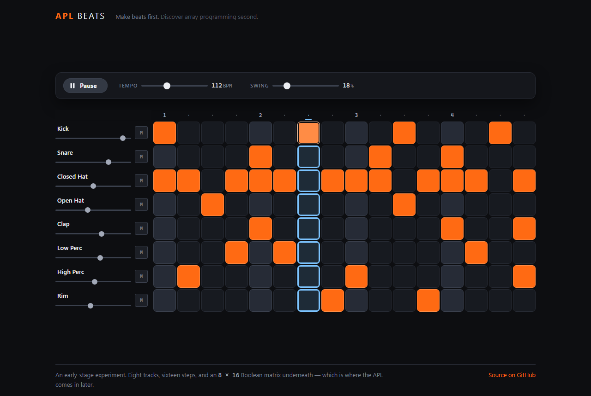

# APL Beats

**Make beats first. Discover array programming second.**

A generative rhythm machine in the browser. Eight tracks, sixteen steps, and a groove
already loaded — press Play.

Live site: <https://dragnim.github.io/aplbeats/>

Underneath the grid is an 8 × 16 matrix of Booleans, which is not an implementation
detail but the whole idea. A rhythm is a rectangular array, array languages are good at
rectangular arrays, and a later release will hand that same matrix to real
[Dyalog APL](https://www.dyalog.com/) and take a transformed one back. None of that is
built yet. What is built is the instrument it will be built on top of.


> **Early stage.** This is Stage 1: a drum machine that works, sounds decent and behaves
> itself. There is no APL in it yet. See [What is not here yet](#what-is-not-here-yet).

---

## Contents

- [What it does](#what-it-does)
- [What is not here yet](#what-is-not-here-yet)
- [Local setup](#local-setup)
- [Development commands](#development-commands)
- [How it is put together](#how-it-is-put-together)
- [Audio timing](#audio-timing)
- [Sounds and licensing](#sounds-and-licensing)
- [Accessibility](#accessibility)
- [Respecting the device](#respecting-the-device)
- [Testing](#testing)
- [Deployment](#deployment)
- [Where APL comes in](#where-apl-comes-in)
- [Licence](#licence)

---

## What it does

- **Eight tracks, sixteen steps.** Kick, Snare, Closed Hat, Open Hat, Clap, Low Perc,
  High Perc and Rim, across one bar of four-four in sixteenth notes.
- **A groove on arrival.** The page opens on a written pattern at 112 BPM with a little
  swing, not an empty grid. Audio does not autoplay — browsers forbid it and nobody
  wants it — so the first press of Play is the first sound.
- **Play and Pause.** Pause keeps its place in the bar and resumes from it.
- **Tempo and swing**, both live: change either while it plays and it takes effect on
  the next sixteenth without restarting anything.
- **Editing by click, tap, drag or keyboard.** Press a step to toggle it; drag with a
  pointer to paint a run of them; arrow keys, Home, End and Space to work without a
  mouse.
- **Mute and a fader per track**, with the pattern left intact underneath a mute.
- **Previewing.** Press a track's name to hear it on its own, which is how a fader gets
  set by ear while the transport is stopped.
- **A visible playhead** driven by the audio clock, not by animation.

On a phone the whole bar stays on screen — the track's name, fader and mute move above
its steps rather than beside them, because a sequencer whose pattern you cannot see is
the wrong trade.


## What is not here yet

Named because a README that lists ambitions alongside features is a README that cannot
be trusted about either. None of the following exists:

- APL. There is no code editor, no execution, no TryAPL, no network call of any kind.
- Generation — randomise, density, complexity, syncopation, variation.
- Presets, saving, sharing, undo.
- Export of any sort: no WAV, no MIDI.
- More than one bar, more than sixteen steps, more than eight tracks.
- Per-step velocity or accents. A step fires or it does not; the matrix is Boolean.
- A light theme.

## Local setup

Requires **Node 22**, not merely Node 22 or later. `.nvmrc` says so and `engines`
refuses anything newer, so that a build here and a build in CI produce the same bundle.

```bash
git clone https://github.com/dragnim/aplbeats.git
cd aplbeats
nvm use        # reads .nvmrc; CI reads the same file
npm install
npm run dev
```

## Development commands

| Command                | What it does                                                |
| ---------------------- | ----------------------------------------------------------- |
| `npm run dev`          | Vite dev server                                             |
| `npm run build`        | Typecheck, then build to `dist/`                            |
| `npm run preview`      | Serve `dist/` at the published base path                    |
| `npm run typecheck`    | `tsc --noEmit`                                              |
| `npm run lint`         | ESLint, type-aware                                          |
| `npm run format`       | Prettier, writing                                           |
| `npm run format:check` | Prettier, checking — this is what CI runs                   |
| `npm test`             | Unit and component tests, once                              |
| `npm run test:watch`   | The same, watching                                          |
| `npm run test:e2e`     | Playwright, across three browser projects                   |
| `npm run screenshot`   | Capture the interface to `docs/`, against a running preview |

## How it is put together

Vite, React and TypeScript in strict mode, with CSS Modules over a token layer. No state
library, no component library, no audio library. The dependency list is React and
nothing else.

```
src/
  pattern/     the 8 × 16 matrix, the eight tracks, the mixer, the opening groove
  transport/   the timing arithmetic, the look-ahead scheduler, the transport
  audio/       the AudioContext boundary, the synthesised kit, the DSP pieces
  components/  the sequencer grid, the transport bar, the track controls
  app/         the application shell and the state it holds
  styles/      tokens and the global sheet
```

Three rules shape it.

**The pattern is a matrix and nothing else.** `src/pattern/pattern.ts` holds
`readonly boolean[][]` and a handful of pure functions over it. No note objects, no
per-cell metadata, no DOM references, no identifiers. Anything a track needs beyond
"does it fire on this step?" lives in the track definitions or the mixer, deliberately
alongside rather than inside. `toBits` and `fromBits` are the numeric form APL will
exchange, and they are written now so the eventual boundary has to stay honest.

**The model does not know the DOM exists.** Nothing in `pattern/`, `transport/` or
`audio/` imports React. The interface renders the pattern and reports edits; it never
owns one. Every state change is a pure function returning a new matrix, which is what
will let undo be a stack of them.

**The audio clock and the render loop never touch.** See below.

## Audio timing

The visual playhead is not responsible for musical timing, and cannot be.

```
a timer wakes about 40 times a second
  → looks 100 ms into the future
  → hands every step falling inside that window to Web Audio, with an exact time
  → Web Audio plays it on the audio thread, to the sample
```

The main thread can then stall for eighty milliseconds and the beat does not move,
because the notes for that eighty milliseconds were handed over before it happened.
This is the look-ahead scheduler pattern from Chris Wilson's _A Tale of Two Clocks_, and
it is the standard answer for good reason.

The playhead the interface draws is a _consequence_ of what was scheduled.
`Scheduler.playheadStep()` reads the audio clock and reports the last step it has
actually passed, so a frame drawn late shows where the music is rather than where it was
when the frame was requested — and when frames stop arriving there is no queue of missed
updates to replay, because there is no queue. Animation reads the same truth the ear
does and cannot influence it.

Swing is applied to each step's position on the straight grid rather than added to a
running total. Swing that accumulated would lengthen the bar a little on every pass, and
a bar that grows is a tempo that drifts — the one fault in a drum machine that is almost
impossible to hear happening and trivial to write a test for. There is such a test.

The scheduler takes its clock, its timer and its tempo as arguments, so the whole of the
above is verified in milliseconds without a browser, an audio device or a wait.

## Sounds and licensing

**Everything is synthesised in the browser.** There is no audio file in this repository,
none is fetched, and nothing streams from anywhere during playback. See
[THIRD_PARTY_NOTICES.md](THIRD_PARTY_NOTICES.md).

That was a decision rather than a shortcut. A public repository should not carry audio
whose licence anyone has to take on trust, and establishing real provenance for a
percussion kit is not work that can be done honestly in an afternoon. Synthesis avoids
the question: the sounds are original, they add nothing to the download, and they are
parameters rather than recordings — which is the form a later release can open up to
editing.

It is also not the same as bleeping. Each voice is built the way the instrument it is
named after behaves, and the way the classic machines got there:

- **Kick** — a sine swept 165 Hz to 47 Hz in ninety milliseconds, saturated. The
  saturation matters more than it looks: laptop and phone speakers cannot reproduce
  47 Hz at all, and it is the harmonics that let them imply it.
- **Snare** — two detuned triangles for the drum, tuned noise for the wires underneath,
  with different decays, because a snare where both stop together sounds like a gated
  sample.
- **Hats** — six square waves at inharmonic ratios of a 40 Hz base through a narrow band
  at nine kilohertz. The TR-808's design, and the reason its hats sound like metal
  rather than filtered hiss. A little noise over the top, which the 808 has none of.
- **Clap** — three noise bursts eleven milliseconds apart and then a tail, because a
  clap is several hands not quite together.
- **Percussion and rim** — pitched bodies with short noise transients, tuned to sit
  clear of the kick.

Every number in there was arrived at by listening, and sound design remains
**provisional**. `Kit` in `src/audio/kit.ts` is the seam: a sample-backed kit satisfying
the same signature can replace this one without the sequencer, the scheduler or the
interface knowing anything changed.

## Accessibility

- **Every step is a real button** with an accessible name — `Kick, step 5` — and its
  state in `aria-pressed`. The state is deliberately not part of the name: a name
  containing "active" has to be re-announced in full every time it changes, where a
  pressed state is announced as the change it is and can be queried at any time.
- **One Tab stop for the whole grid**, by roving tabindex, rather than a hundred and
  twenty-eight. Arrow keys move between neighbouring steps, Home and End reach the ends
  of the bar, and Space or Enter toggles.
- **Colour is never the only signal.** An active step is a filled solid where a silent
  one is a recessed outline; the playhead carries a marker on the ruler as well as a
  column wash, and is cool where sound is warm; a muted track dims _and_ marks its
  button _and_ reports `aria-pressed`. With every colour removed the grid still reads.
- **Contrast** is checked against WCAG 2.2 AA — 4.5:1 for text, 3:1 for the playhead and
  for an active step as non-text indicators.
- **`prefers-reduced-motion`** removes the movement and replaces what it was for: the
  current column gains a real outline, so "which step is this" is answered by a static
  difference instead of by having watched something arrive.

  

- **Target size.** On a desktop the pads are comfortably past 24 px. On a phone sixteen
  targets of that size do not fit across the screen, so the track name moves above its
  steps, the grid reaches the edges, and conformance comes from WCAG 2.2's spacing
  exception: adjacent centres more than 24 px apart. The gap between pads is
  load-bearing rather than decorative, and there is a test asserting the pitch.

Verified by hand and by the end-to-end suite. Not yet audited with an actual screen
reader, which is the honest gap: `aria-pressed` on a hundred and twenty-eight buttons
inside eight groups is a reasonable reading of the specification, and how NVDA, VoiceOver
and Narrator each choose to announce it is a separate question.

## Respecting the device

The intention is that APL Beats costs nothing when it is not being used, and this is
meant to hold for every stage of the project.

- **Stopped means stopped.** No scheduler timer, no animation frame, and the
  `AudioContext` suspended — because a running one keeps an audio thread awake whether
  or not anything is connected to it.
- **Playing costs one timer and one frame loop**, and the frame loop sets React state
  only when the step number actually changes: about eleven re-renders a second at
  112 BPM rather than sixty.
- **Leaving the tab pauses the transport.** Partly because timers in a hidden tab are
  throttled to once a second, which would shred the beat; mostly because a page that
  carries on drumming after you have gone somewhere else is a page that gets muted and
  then closed. It also means there is nothing to catch up on when you come back.
- **A muted track builds no audio graph at all**, rather than one at zero gain.
- **Nothing is fetched at runtime.** The Content-Security-Policy in `index.html` says
  `connect-src 'self'`, which is not a restriction being worked around but a true
  statement about the application — and one that should keep failing loudly if it ever
  stops being true.

## Testing

```bash
npm test          # 138 unit and component tests, in jsdom
npm run test:e2e  # 25 end-to-end tests across three browser projects
```

The unit tests cover the pattern model and its bounds, the mixer, the timing
arithmetic, the swing maths, and the scheduler — the last driven by an injected virtual
clock, so its behaviour under a stalled main thread, a tempo change mid-bar, a pause and
resume, and a nonsense tempo are all assertions rather than hopes.

The end-to-end suite covers what only a browser can answer: that the page loads without
console errors, that the playhead advances off a real audio clock, that a pointer drag
paints and a second drag erases, that the grid is navigable by keyboard, that a
phone-sized window shows the whole bar with reachable targets, that reduced motion is
honoured, and that leaving the tab pauses playback.

Three browser projects, for a reason worth knowing about: **Playwright's WebKit is built
without Web Audio** — `AudioContext` is not on the window at all. So `mobile-webkit`
checks the phone layout on the engine phones actually run, `mobile-chromium` checks
touch interaction on an engine that can make a sound, and the audio tests ask the page
whether Web Audio exists and skip themselves rather than pretending. That is a
limitation of that build, not of Safari.

What no test covers is whether it sounds good. That is judged by ear.

## Deployment

One workflow. `verify` and `e2e` must both pass before the Pages artifact is built, and
the deploy step abandons itself if `main` has moved on — so what is published is always
a commit that passed every check, and never an older site over a newer one.

The published base path comes from `actions/configure-pages`, so renaming the repository
needs no code change. `VITE_BASE` overrides it locally or for a custom domain.

## Where APL comes in

Not yet — but the shape is already decided, and it is the reason for several of the
choices above.

```
APL generates or transforms a complete pattern matrix
  → the browser receives the matrix
  → Web Audio plays it locally
```

APL will run **once per deliberate action** — pressing Randomise, changing a
generator's parameters and asking for a new pattern — and never once per beat, once per
step, once per animation frame, or continuously while a control is being dragged.
Requests will be sparse, cached and preferably batched. Nothing in the current
architecture puts a network call anywhere near the scheduler, and nothing should: the
transport reads the pattern through a getter that returns whatever is in memory, and it
must stay that way.

## Licence

[MIT](LICENSE). An independent personal project, not a Dyalog product.
