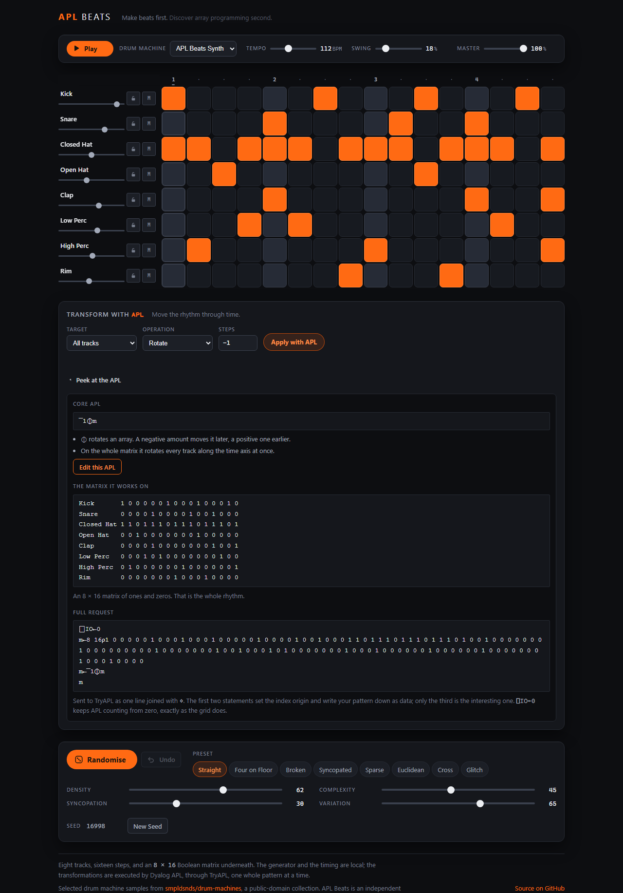
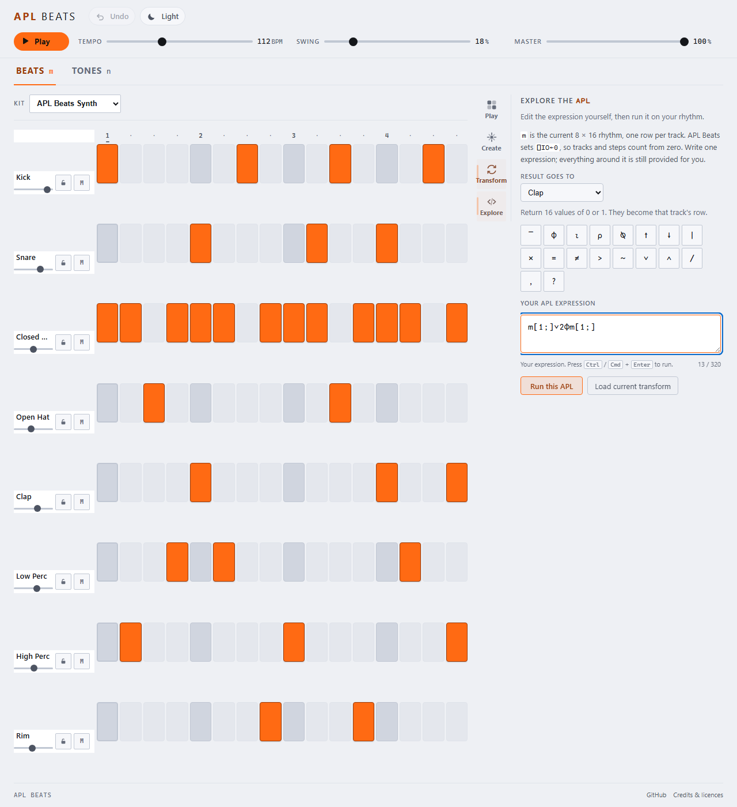

# APL Beats

**Make beats first. Discover array programming second.**

A generative rhythm machine in the browser. Eight tracks, sixteen steps, a groove already
loaded — press Play, then press Randomise.

Live site: <https://dragnim.github.io/aplbeats/>

Underneath the grid is an 8 × 16 matrix of Booleans, which is not an implementation detail
but the whole idea. A rhythm is a rectangular array, array languages are good at rectangular
arrays — and pressing **Apply with APL** sends that matrix to real
[Dyalog APL](https://www.dyalog.com/) and plays back the matrix that comes home.

The whole product is three steps, and they are meant to be taken in order:

**Play.** Make a beat. Press Randomise until one of them is yours. Choose a drum machine.

**Peek.** Look at the APL behind the operation you just used. `¯1⌽m[0;]` — that line moved your
kick, and the rhythm it moved really is an array.

**Explore.** Change the line. Change `¯1` to `¯2` and run it: the kick moves an eighth instead
of a sixteenth. Then realise the number was never the only thing you could change.

> **What runs where, precisely.** Generation and timing are local TypeScript and Web Audio. The
> four transformations are executed by Dyalog APL, remotely, via [TryAPL](https://tryapl.org/).
> There is no local fallback for them: if APL is unavailable the transform does not happen and the
> beat is left alone, because an interface that says "Apply with APL" and quietly computed the
> answer itself would be lying. See [Transform with APL](#transform-with-apl).

```
        TypeScript generator
                ↓
        Boolean 8 × 16 pattern  ⇄  real Dyalog APL transforms, through TryAPL
                ↓
        Web Audio scheduler
                ↓
        the selected drum machine — synthesised, or sampled
```

The drum machine is a **rendering** choice. It decides what the pattern sounds like and nothing
else: APL sees the same matrix whichever machine is playing it.


---

## Contents

- [What it does](#what-it-does)
- [Transform with APL](#transform-with-apl)
- [Explore the APL](#explore-the-apl)
- [The generator](#the-generator)
- [The four macros](#the-four-macros)
- [Presets](#presets)
- [Locks](#locks)
- [Undo](#undo)
- [What is not here yet](#what-is-not-here-yet)
- [Local setup](#local-setup)
- [Development commands](#development-commands)
- [How it is put together](#how-it-is-put-together)
- [Master volume](#master-volume)
- [Audio timing](#audio-timing)
- [Drum machines](#drum-machines)
- [Drum machine samples and credits](#drum-machine-samples-and-credits)
- [Sounds and licensing](#sounds-and-licensing)
- [Review tooling](#review-tooling)
- [Accessibility](#accessibility)
- [Privacy and what leaves the browser](#privacy-and-what-leaves-the-browser)
- [Respecting the device](#respecting-the-device)
- [Testing](#testing)
- [Deployment](#deployment)
- [Where APL goes next](#where-apl-goes-next)
- [Licence](#licence)

---

## What it does

- **Eight tracks, sixteen steps.** Kick, Snare, Closed Hat, Open Hat, Clap, Low Perc, High
  Perc and Rim, across one bar of four-four in sixteenth notes.
- **Ten drum machines, plus the synthesised kit.** TR-808, TR-909, LinnDrum LM-2, CR-8000,
  Drumtraks, Casio RZ-1, MFB-512, Yamaha MR10, 808 Mini and Casio SK-1 — changing machine changes
  the sound and never the rhythm.
- **Four transformations, executed in APL.** Rotate, Reverse, Periodic and Euclidean, on one
  track or on the whole matrix — with the expression that ran on show if you want to see it.
- **And then you can edit that expression.** Write your own APL against the current rhythm and
  run it. Real Dyalog, real errors, your beat.
- **Randomise.** A new take on the groove you have, as far away as Variation allows.
- **New Seed.** A completely new groove, ignoring Variation.
- **Four macros** — Density, Complexity, Syncopation, Variation — each with a distinct
  musical meaning.
- **Eight presets**, which change how the generator behaves rather than loading a fixed
  pattern.
- **A lock per track.** The generator may not touch a locked row; you still can.
- **Undo**, thirty deep, over every creative action.
- **A groove on arrival.** Audio does not autoplay, so the first press of Play is the first
  sound.
- **Play and Pause**, live tempo and swing, master volume, mute and a fader per track.
- **Editing by click, tap, drag or keyboard**, unchanged from Stage 1.
- **Your session comes back** when you do — pattern, seed, preset, macros, locks, tempo,
  swing and mixer. It never starts playing on its own.
- **Undo covers transforms too**, so an operation you did not like costs one button.

On a phone the whole bar stays on screen: each track's name, fader, lock and mute move
above its steps rather than beside them.


## Transform with APL

This is the stage where APL stops being a plan.

Choose a track — or all of them — choose an operation, set its number, and press **Apply with
APL**. The pattern is written down as an APL matrix literal, sent to
[TryAPL](https://tryapl.org/) as one expression, evaluated by Dyalog APL, and the eight lines
of ones and zeros that come back become your bar. Nothing about that sentence is a metaphor.

```
your 8 × 16 matrix
  → an APL literal:  8 16⍴1 0 0 0 0 0 1 0 …
  → one expression:  ⎕IO←0 ⋄ m←8 16⍴… ⋄ m[0;]←¯1⌽m[0;] ⋄ m
  → POST to tryapl.org, evaluated by Dyalog APL
  → eight lines of sixteen digits
  → validated, then played
```

### The four operations

`⎕IO←0` is sent with every request, so the APL indices and the grid indices are the same
number. There is no off-by-one anywhere between the sequencer and the interpreter.

| Operation     | The APL       | What it does musically                                                                     |
| ------------- | ------------- | ------------------------------------------------------------------------------------------ |
| **Rotate**    | `¯1⌽m[0;]`    | Moves a rhythm through time. Negative is later. On the whole matrix, every track together. |
| **Reverse**   | `⌽m`          | The last sixteenth becomes the first. `⌽` with nothing on its left.                        |
| **Periodic**  | `0=4\|⍳16`    | A steady pulse every few steps. Four gives you the beats; three gives a cross-rhythm.      |
| **Euclidean** | `5>16\|5×⍳16` | Spreads k hits as evenly across sixteen steps as the arithmetic allows.                    |

Rotate and Reverse **transform** a row, so they can be applied to all eight at once. Periodic
and Euclidean **replace** a row, so they cannot: eight identical rows is not a rhythm, it is a
mistake with eight voices. The Target menu offers what the operation accepts and nothing else.

**Euclidean is `k>16|k×⍳16`, and that was checked rather than trusted.** It is one line where
Bjorklund's algorithm is a recursion, which is exactly the sort of claim that deserves
suspicion. Stage 2 already contains a verified Bjorklund implementation, so the two were
compared exhaustively — in TypeScript, at no cost to TryAPL, by
[`scripts/check-euclidean.ts`](scripts/check-euclidean.ts). Eleven of the seventeen pulse
counts are identical to Bjorklund and the other six are the same rhythm at a fixed rotation,
with the gap structure — never more than two distinct gap lengths, differing by one — holding
throughout. The offset is constant per pulse count, so the Shift control behaves identically in
either formulation.

### There was a fifth, and it was removed

`(s×⍳8)⌽m` gives `⌽` a **vector** left argument, so all eight rows rotate by their own amount
in one glyph, with no loop and no index. It was built as "Stagger" and taken out again after
the musical review, because it was the best APL in the project and the worst music:

1. under `⎕IO←0` the first row's rotation is `s×0`, so the kick never moved at all — which is
   not what "shift each track a little further than the one above" promises;
2. the backbeat was lost at seven of its eight settings;
3. `¯1` and `3` smeared by the same degree, so the control reshuffled rather than intensified,
   and every press had the same character.

The evidence is still reproducible — `npm run review:transforms -- --stagger` computes it —
because a claim that something was rejected is worth nothing without the grid that rejected it.
Make beats first.

### Peek at the APL

Underneath the button is a disclosure showing three things: the **core expression**, with two
lines explaining its glyphs; **your pattern as an array**, one row or all eight; and the **full
request**, the four statements exactly as they are joined with `⋄` and sent.

What it shows is what runs. Not a simplified version, not a pretty-printed one — the same
string the client posts. That is the entire value of the feature, so the tests assert it: the
expression read out of Peek must equal the expression that went over the wire.

Opening Peek makes **no request**. The APL is built from a template in the browser, so it is
free to look at, and it updates as you change the controls.



The glyphs are set in APL387, bundled at 23 KB. It is public domain under The Unlicence, so it
can be shipped rather than fetched from someone else's CDN — see
[THIRD_PARTY_NOTICES.md](THIRD_PARTY_NOTICES.md).

### Why the timing is not in APL

Because a network is not a clock. Sample-accurate scheduling needs decisions in the low
milliseconds and a round trip to TryAPL takes tens to hundreds of them on a good day, with no
guarantee on a bad one. A drum machine whose tempo depended on somebody else's HTTP latency
would not be a drum machine.

So the division is: **APL decides what the pattern is; Web Audio decides when it is heard.**
That is not a compromise imposed by the wire — it is the same division a hardware sequencer
makes between its pattern memory and its clock.

### The request discipline

TryAPL is a free service run by other people, and this application is a guest on it. So the
rules are enforced in code rather than promised in prose, in one file
([`src/apl/useTransform.ts`](src/apl/useTransform.ts)) small enough to read in a sitting:

- **One deliberate press, at most one request.** `apply` is the only function that can cause
  one, and it is called from one button.
- **Never** per beat, per step, per cell, per animation frame, from the scheduler, from
  playback, on hover, while a control is moving, or continuously while editing.
- **The parameters are spinners, not sliders.** A slider invites dragging and dragging invites a
  request per value. That is not a styling choice, it is the interaction shape the promise
  requires — and a test drags the numbers through their whole range and asserts zero requests.
- **A second press while one is in flight is dropped**, not queued. A held-down key cannot
  become a request storm.
- **Nothing retries.** Not the client, not the service layer, not the hook. A failure is a
  failure, reported once.
- **Identical questions are answered from memory.** Thirty-two answers, keyed on the operation,
  the target, the parameters and the whole pattern — so Apply, Undo, Apply costs one request
  rather than two, and the interface says "Applied, from cache." when it did.
- **`npm test`, `npm run test:e2e`, CI and the Pages deployment make zero live requests.** The
  end-to-end suite mocks the endpoint and drives the real product flow through it.

Live APL is verified deliberately, by hand, by two commands and no others:

```bash
npm run verify:apl-live               # four requests, one per operation
npm run verify:apl-live -- --dry-run  # prints the expressions, sends nothing
npm run verify:deployment             # one request, from the published origin
npm run verify:deployment -- --no-apl # everything except that request
```

`verify:apl-live` builds each expression with the production source builder, sends it with the
production client, reads it with the production parser, and compares the result against the
TypeScript reference — then prints the request count on its own line, whether or not anybody
asked. It refuses to run under CI unless forced.

`verify:deployment` makes the one check nothing else can. Whether a browser will _allow_ the
request from `https://dragnim.github.io` depends on TryAPL's CORS headers and on the
Content-Security-Policy as actually served, and neither can be established from a mock or from
localhost. So it loads the published site, opens Peek, reads the expression, presses Apply
once, and asserts the grid became the reversal of what was sent. Neither command is ever run by
CI.

### What comes back is not trusted

An APL error arrives as **HTTP 200**. `LENGTH ERROR` and a caret look exactly like a successful
reply as far as the status code is concerned, so the status code is not what decides. Every
reply passes through:

1. a bounded read — counted in **bytes off the stream**, not characters after decoding, because
   APL glyphs are two or three bytes each and a reply well past the limit can measure
   comfortably inside it if you count `String.length`;
2. JSON parsing, with a stated failure rather than a thrown exception;
3. shape validation of the wire array, assuming nothing;
4. a scan for eleven named APL errors;
5. strict matrix parsing — **exactly** eight lines of **exactly** sixteen tokens, each token
   exactly `"0"` or `"1"`.

Anything that fails leaves the pattern untouched and puts one sentence on screen. Every one of
those sentences ends by saying the beat was not changed, because that is the only thing you
actually need to know; the raw detail goes to the console for whoever wants it.

A reply is also dropped if it **no longer applies**. Between asking and answering you may have
edited a cell, pressed Randomise, or undone something, and a matrix computed from a bar that no
longer exists must not overwrite the bar that does. Compared by value rather than by a revision
counter, so a bar that was edited and then undone still accepts its answer.

### There is no APL editor

You cannot type APL into APL Beats, and this stage deliberately does not let you. The numbers
from the controls are clamped to ranges declared in
[`src/apl/operations.ts`](src/apl/operations.ts) and only then formatted into a template. No
string from the interface is ever spliced into executable source — which is what makes "no
arbitrary APL" a property of the code rather than a claim about the UI. A test builds every
operation at every target with every parameter driven to `±1e9` and `NaN`, and asserts the
result never contains a quote, a comment, `⍎`, `⍕`, `#`, or a system command.

An editor is a later stage's problem, and a much larger one.

### A transform is one Undo

A successful transform banks exactly one history entry, so an operation you did not like costs
one button. A transform that changed nothing — reversing an already-symmetrical row, rotating
by a full bar — banks none, because an Undo that appears to do nothing is worse than no Undo.

Locks are deliberately **not** consulted. A lock means "the generator may not alter this row",
and a transform is not the generator: it is you, naming a row and asking for it to change. The
one case worth knowing about is an operation on the whole matrix, which touches every row
including a locked one — that is what "All tracks" means, and it is the visitor's choice.

## Explore the APL

Peek shows you the expression. Explore lets you change it.

```
CORE APL

¯1⌽m[0;]

⌽ rotates an array. A negative amount moves it later…

[ Edit this APL ]
```



Pressing that opens an editor holding **exactly** the expression Peek was displaying — not a
teaching approximation, not a separate example. Change `¯1` to `¯2`, press **Run this APL**, and
the kick moves two sixteenths instead of one. That is the entire feature, and everything below is
detail.

### What you write, and what the application still provides

You write **one expression**. APL Beats writes everything around it:

```apl
⎕IO←0 ⋄ m←8 16⍴1 0 0 0 … ⋄ m[0;]←(your expression) ⋄ m
```

- **`m` is the current rhythm** — an 8 × 16 matrix of Booleans, one row per track. You never
  declare it, and you never paste 128 numbers into anything.
- **`⎕IO←0`**, so tracks and steps count from zero, exactly as the grid does.
- **Result goes to** decides where your answer is installed. Choose a track and your expression
  must return 16 values; choose _All tracks_ and it must return an 8 × 16 matrix.

The parentheses matter more than they look: bracketing your expression means whatever precedence
you wrote cannot reach the assignment, so almost nothing has to be forbidden.

### It is genuinely your APL that runs

Nothing here is simulated. The expression is wrapped, posted to TryAPL, evaluated by Dyalog, and
the matrix that comes back becomes the rhythm — the same path the four fixed operations use, in
the same execution lane, with the same validation. There is no local fallback, and no TypeScript
quietly standing in for anything.

Which means **the errors are real too**, and Stage 5 shows them. Stage 3 could keep interpreter
detail off screen because the application wrote its own APL and any error was its own bug; here
the mistake is yours, and "APL could not run that" without the word `RANK` and a caret pointing
at the glyph would be useless:

```
RANK ERROR: Mismatched left and right argument ranks
      m←(2 3⍴m)
         ∧
```

The beat is untouched, your code is untouched, and there is nothing to undo.

### A few things to try

Each of these is one line, and each does something you can hear. The four fixed operations are
also a source of starting points: change the Operation and the editor follows, until you edit it.

| Expression      | Result goes to | What happens                                            |
| --------------- | -------------- | ------------------------------------------------------- |
| `¯2⌽m[0;]`      | Kick           | The kick an eighth later instead of a sixteenth.        |
| `0=3\|⍳16`      | Closed Hat     | Every third sixteenth: three against four.              |
| `~m[2;]`        | Open Hat       | The open hat in exactly the gaps the closed hat leaves. |
| `m[1;]∨2⌽m[1;]` | Clap           | A clap built from the snare, doubled an eighth early.   |
| `m[0;]∧~m[1;]`  | Rim            | A rim wherever the kick plays and the snare does not.   |
| `16⍴1 0 0`      | High Perc      | A three-step figure reshaped to fill the bar.           |

There is deliberately **no Examples menu**. The Operation control already loads four real,
working expressions into the editor, and a second list beside it would be a second thing to
maintain and a busier panel for no new capability.

### Typing APL without an APL keyboard

A compact strip of the glyphs these rhythms actually need — `¯ ⌽ ⍳ ⍴ ⍉ ↑ ↓ | × = ≠ > ~ ∨ ∧ / ,` —
inserts at the caret and replaces the selection, exactly as typing would. It is not a virtual
keyboard, and anyone with a real APL layout can ignore it. Every button is named as well as drawn,
so it is usable without seeing it.

**Ctrl+Enter** or **Cmd+Enter** runs the expression. Plain Enter does not: this is a box you write
in, and a stray newline should not spend somebody else's compute.

### What Explore will not do

- **It is one expression, not a workspace.** No `⋄`, no newlines, no comments, no `)` session
  commands — each of those would change what the statements around your expression mean, and each
  is refused locally with a sentence saying why, before anything is sent.
- **It is not a security sandbox, and does not pretend to be one.** TryAPL is the sandbox and
  refuses what it refuses; a blacklist here would be theatre, and the kind that gets trusted.
- **The result must still be a rhythm.** Exactly 8 × 16, exactly zeros and ones. Anything else is
  refused whole — never truncated, never reshaped "helpfully", never coerced.
- **A generous but finite length**: 320 characters, counted in glyphs.

### Your draft is yours

The editor follows the fixed controls only until you touch it. After that it is a draft, and
changing the Operation, a parameter or the Target will not overwrite it — only **Load current
transform**, which says exactly what it does. The draft survives a reload, under its own storage
key, and **never runs itself on restore**.

### Nothing is sent until you press Run

Opening Peek, opening Explore, typing, deleting, inserting a glyph, changing the target, loading
the current transform, restoring a draft, playing, pausing — none of these makes a request. One
press of Run, or one Ctrl+Enter, makes at most one. Holding the shortcut down makes one.

Explore and **Apply with APL** share **one execution lane**: while either is running the other's
button is disabled, so there is never more than one request in flight from this application.

### A result can never lie about the code that produced it

Two things can move while a request is out, and both are handled the same way — the answer is
discarded and nothing is claimed:

- **the pattern**, if you edit a cell, press Randomise or undo something;
- **the code**, if you carry on writing while your last run is still in the air.

Editing during a run is allowed on purpose. The network should not freeze somebody's writing, so
it is the reply that gets thrown away rather than the keyboard that gets locked.

## The generator

Every groove is a pure function of its inputs:

```
generator version + seed + preset + Density + Complexity + Syncopation
    → a candidate bar
    then Variation decides how much of that candidate is adopted
```

The same inputs give the same 128 Booleans on every machine, for ever. There is no
`Math.random` anywhere in the generation path — the one non-deterministic call in the whole
application is the drawing of a fresh seed when you press Randomise, and everything
downstream of it is reproducible from the number shown on screen.

**Randomise draws a new seed and blends.** Using the current seed would produce the
identical candidate and the button would appear broken from the second press onwards. The
seed shown is therefore the seed of the most recent candidate.

**New Seed regenerates outright.** Variation does not apply. At a low Variation the two
buttons behave very differently, which is what makes both worth having.

**Changing a preset or a macro re-renders the same seed** at the new setting, so the groove
you are shaping stays the groove you are shaping. Variation is the exception: it says what
the _next_ Randomise will do, so moving it does not touch the current bar.

Generation is not a probability per cell. It works from a metrical model — where events
want to be in a bar of four-four — and then from what each instrument wants, and then from
how the eight parts relate to each other. An open hat is placed where the closed hat is
not, and the closed hat gives way where it lands; a clap doubles or shadows the snare; the
high percussion answers the low; the auxiliary tracks play short figures that come round
again rather than scattering single hits. Those relationships are generated, not hoped for.

### The opening bar is hand-written

The pattern APL Beats opens on is the curated groove from Stage 1, not a generated one. A
search over thirty thousand seeds and every preset found nothing better: the closest match
reproduced the curated hat and open-hat rows exactly and its kick almost exactly, but with
a third fewer triggers and thin percussion, and the only bars that reproduced the curated
kick row came from Glitch, differing by nineteen per cent of their cells and measurably
messier.

So the seed, preset and macro values you arrive on are the **starting point for
generating**, not a recipe that produces the bar in front of you. That distinction is
unavoidable in any case — edit three cells by hand and your pattern is no longer what your
seed produces either — and the canonical truth is simply the current matrix plus the
current settings.

## The four macros

All four run 0–100. They are deliberately four different mechanisms, not four names for one
probability.

| Macro           | Question                     | How it works                                                                                                                                                                                                                                                                                                                                                                       |
| --------------- | ---------------------------- | ---------------------------------------------------------------------------------------------------------------------------------------------------------------------------------------------------------------------------------------------------------------------------------------------------------------------------------------------------------------------------------- |
| **Density**     | How much is happening?       | Sets how many events each track gets, within that track's own range. A hat can carry fourteen; a kick rarely wants more than six. Density therefore does not affect every track equally, which is what a kit actually does.                                                                                                                                                        |
| **Complexity**  | How intricate is the rhythm? | Two things, neither of them a count. It opens up the sixteenth grid — at the bottom of the range the odd steps are shut almost completely, so a pattern _cannot_ be intricate however dense it gets. And it lengthens how far the bar goes before repeating itself: a four-step figure four times over is simple, however many notes are in it.                                    |
| **Syncopation** | How far off the beat?        | Blends the metrical weights towards a second profile that favours the offbeat eighths and the sixteenth _before_ each beat — the anticipation, which is what most syncopation actually is. Not an inversion: inverting metrical weight puts events on the weakest positions, which sounds arbitrary rather than syncopated. At high settings it also lets anchored steps displace. |
| **Variation**   | How far does Randomise move? | Chooses how many of the differing cells to take from the candidate, and — more importantly — _which tracks_ take anything at all. At low settings most tracks are left completely alone, so a bar where the hats developed and nothing else did sounds like a decision rather than a fault.                                                                                        |

Measured over forty seeds, Density takes a bar from about eight triggers to about
thirty-five while Complexity holds the count flat within three; Complexity roughly triples
the events on the sixteenth grid and halves how much the bar repeats itself. Those are
properties the tests assert, as directions rather than thresholds.

Macros commit when the gesture ends — the number moves live, the groove moves once. That
discipline matters more than it looks: it is the interaction shape APL will eventually need,
where regenerating on every input event would be a remote call per pixel.

## Presets

A preset is a set of dispositions, not a saved pattern: how many events each instrument
tends towards, where it likes to sit, which positions it insists on, how readily it repeats
itself, and how the eight parts relate. Two seeds under one preset should sound like two
takes by the same drummer; one seed under two presets like two different drummers.

| Preset            | What it is                                                                                                                                                                                                          |
| ----------------- | ------------------------------------------------------------------------------------------------------------------------------------------------------------------------------------------------------------------- |
| **Straight**      | Backbeat, steady hats, few surprises. The kick is pushed off beats two and four so it does not become Four on Floor.                                                                                                |
| **Four on Floor** | A kick on every beat — the one preset whose name is a testable promise — with hats lifting off it.                                                                                                                  |
| **Broken**        | Beats two and four are weighted almost to nothing on the kick, so it lands on the "and" and the pickups. The snare is allowed to arrive early.                                                                      |
| **Syncopated**    | Anticipations everywhere. The widest travel for the Syncopation control.                                                                                                                                            |
| **Sparse**        | Narrower ranges at both ends, reluctant percussion, hats that repeat over a long period — structured space rather than accidental space.                                                                            |
| **Euclidean**     | Bjorklund's even distribution, each track rotated differently so that eight parts do not all begin together. Syncopation moves the rotation, which is the only thing it sensibly can do to an evenly spread rhythm. |
| **Cross**         | Three- and five-step figures against a four-four pulse.                                                                                                                                                             |
| **Glitch**        | Short bursts with deliberate holes, and a snare that will not stay put. The kick stays disciplined, because a kick of random bursts removes the last thing holding the bar together.                                |

**Cross is not called Polyrhythm**, deliberately. The bar is still sixteen steps and still
repeats, so these are cross-rhythms _within_ a bar rather than independent cycles of
different lengths. Calling it Polyrhythm would claim an architecture this stage does not
have, and expanding the transport to get one was explicitly out of scope.

## Locks

A lock means **the generator may not alter this row**. It does not mean you may not: a
locked track stays fully editable by hand, which is the point — you keep a kick you like and
explore a completely different preset around it.

Locks are respected by Randomise, New Seed, preset changes and macro regeneration alike.
There is no code path in which a locked row is generated and then restored, so there is
nothing to get wrong. Lock state is itself part of Undo.

## Undo

Thirty steps, over the creative state: pattern, seed, preset, all four macros, and locks.

Tempo, swing and the mixer are deliberately **outside** it. They are how you listen to what
you made rather than part of it, and putting them in the history would mean that an Undo
after nudging a fader threw away the groove you had been building.

One action is one entry. A drag across eight cells is one Undo; a slider dragged through
fifty values is one Undo, banked when the gesture began and committed when it ended; an APL
transform is one Undo. There is no Redo yet.

## What is not here yet

Named because a README that lists ambitions alongside features cannot be trusted about
either. None of the following exists:

- **A full APL workspace.** Explore runs one expression. No definitions, no multiple
  statements, no session commands, no files.
- **APL generation.** The generator is still local TypeScript; only the transformations run
  in APL. Moving it is a request-budget problem rather than a translation one — see
  [Where APL goes next](#where-apl-goes-next).
- **Offline transforms.** There is no local fallback, on purpose. No APL, no transform.
- Sharing, WAV export, MIDI, accounts.
- More than one bar; variable track lengths; song arrangement.
- Per-step velocity or probability. A step fires or it does not.
- Effects, sample uploads, a light theme.
- Redo.

## Local setup

Requires **Node 22**, not merely Node 22 or later. `.nvmrc` says so and `engines` refuses
anything newer, so that a build here and a build in CI produce the same bundle.

```bash
git clone https://github.com/dragnim/aplbeats.git
cd aplbeats
nvm use        # reads .nvmrc; CI reads the same file
npm install
npm run dev
```

## Development commands

| Command                     | What it does                                                                         |
| --------------------------- | ------------------------------------------------------------------------------------ |
| `npm run dev`               | Vite dev server                                                                      |
| `npm run build`             | Typecheck, then build to `dist/`                                                     |
| `npm run preview`           | Serve `dist/` at the published base path                                             |
| `npm run typecheck`         | `tsc --noEmit`                                                                       |
| `npm run lint`              | ESLint, type-aware                                                                   |
| `npm run format:check`      | Prettier, checking — this is what CI runs                                            |
| `npm test`                  | Unit and component tests, once                                                       |
| `npm run test:e2e`          | Playwright, across three browser projects                                            |
| `npm run review:patterns`   | Inspect many generated bars — see [Review tooling](#review-tooling)                  |
| `npm run review:transforms` | Read what each transformation does to a beat, before and after                       |
| `npm run verify:apl-live`   | **Four real TryAPL requests.** Manual, never in CI                                   |
| `npm run screenshot`        | Capture the interface to `docs/`, against a running preview                          |
| `npm run measure:kit`       | Render every synthesised voice and report its level and length (needs `npm run dev`) |
| `npm run measure:kits`      | Measure every drum machine and check the calibration (needs `npm run dev`)           |
| `npm run import:samples`    | Re-fetch the samples from the pinned upstream commit and checksum them               |
| `npm run render:tr909`      | Re-render the TR-909 from the pinned upstream DSP; `-- --check` verifies only        |
| `npm run verify:credits`    | Check every attribution claim against the live upstream repositories                 |
| `npm run measure:generated` | Render generated bars through the real master chain and check for clipping           |
| `npm run verify:deployment` | Load the published site and check it works. **One real TryAPL request**              |

## How it is put together

Vite, React and TypeScript in strict mode, with CSS Modules over a token layer. No state
library, no component library, no audio library. The dependency list is React and nothing
else.

```
src/
  apl/         everything that touches Dyalog APL, and nothing that does not
    config.ts      the endpoint and the limits; refuses a non-HTTPS endpoint
    wire.ts        the TryAPL Exec format, and the eleven APL error names
    matrix.ts      a pattern → an APL literal, and eight strict lines → a pattern
    operations.ts  the four operations: their APL, their ranges, their explanations
    custom.ts      wrapping a hand-written expression, and the few inputs that cannot be
    client.ts      the only network request in the application
    transform.ts   the cache, and the staleness rule
    useTransform.ts  when a request may happen. The whole promise lives here
    reference.ts   what the APL means, in TypeScript — imported by tests only
  generation/  the generator — pure, deterministic, and knows nothing of React
    prng.ts        a 32-bit PRNG; streams derived per track by hashing
    weights.ts     the metrical model and what the macros do to it
    euclidean.ts   Bjorklund's algorithm, alone in a file
    presets.ts     eight sets of dispositions, almost entirely data
    generator.ts   settings → an 8 × 16 matrix
    mutate.ts      how much of a candidate to adopt
    metrics.ts     measurement, for the tests and the review tooling
  audio/
    kits/
      types.ts       what a kit is: eight sounds, and no authority over anything else
      kits.ts        the ten machines, and which sound plays on which row
      provenance.ts  where every bundled sample came from, and on what basis
      checksums.json generated: the bytes of every bundled file
    kit.ts         the eight synthesised voices
    sampleKit.ts   a sampled kit, and the choke groups the hardware would have
    kitLoader.ts   fetch, decode, cache. Never more than once
    useDrumMachine.ts  the one identifier that is Stage 4's whole state
  pattern/     the matrix, the eight tracks, the mixer, the opening groove
  transport/   the timing arithmetic, the look-ahead scheduler, the transport
  audio/       the AudioContext boundary, the synthesised kit, the DSP pieces
  components/  the sequencer grid, the generator panel, the transport bar
  app/         the creative state and its history, persistence, the shell
  styles/      tokens and the global sheet
```

Four rules shape it.

**The pattern is a matrix and nothing else** — `readonly boolean[][]`, with pure functions
over it. That is what makes `8 16⍴…` a serialisation rather than a translation.

**Generation is pure and outside React.** Nothing in `generation/` imports React, touches a
clock, or draws randomness it was not given. The reducer that drives it is pure too:
Randomise is _handed_ its seed rather than drawing one, which is why every behaviour in this
stage can be tested by stating inputs and reading outputs.

**Per-track random streams, derived by hashing.** Without that, one extra hat would shift
every later draw and rewrite the whole kit — which would make locks impossible and Variation
meaningless.

**The audio clock and the render loop never touch.** See below.

**The kit is a rendering choice and cannot reach the pattern.** The scheduler asks "play row N at
time T" and has no way of telling whether the answer is an oscillator or a WAV. That is why Stage 4
needed no changes to the scheduler, the transport or the timing at all.

**The APL boundary is one directory and one hook.** Nothing outside `src/apl/` can cause a
request, and inside it only `apply` can. A test forbids any module under `src/` from importing
`reference.ts`, so a silent fallback to the TypeScript implementations is structurally
impossible rather than merely unintended — which is the whole credibility of this stage.

## Master volume

A fader in the transport bar, 0 to 100%, remembered under its own storage key and starting at
full.

The distinction worth stating: **the eight track faders set the mix; Master changes only the
final listening level.** It is the last node in the chain — after the mix bus gain, after the
compressor, after the soft limiter — so turning it down attenuates a finished signal and nothing
else. Put anywhere earlier it would change how hard the compressor is driven, which would alter
the instrument's character and quietly invalidate the kit calibration from
[Drum machines](#drum-machines).

At 100% the output is the one APL Beats has always had, and an end-to-end test proves it by
rendering the same signal through the chain with and without the new node and comparing the
samples. There is no setting above 100%: this is attenuation only, because the headroom at the
top of this chain was measured rather than guessed.

Changes ramp over 20 ms so a moving fader does not click, and moving it while the machine is
stopped opens no audio device at all — the engine simply remembers the number until there is a
graph to apply it to.

## Audio timing

Unchanged from Stage 1, and deliberately so.

```
a timer wakes about 40 times a second
  → looks 100 ms into the future
  → hands every step in that window to Web Audio, with an exact time
  → Web Audio plays it on the audio thread, to the sample
```

The playhead is a _consequence_ of what was scheduled: it reads the audio clock and reports
the last step it has passed, so a frame drawn late shows where the music is rather than
where it was when the frame was requested.

**A generated pattern takes effect immediately, not on the next bar line.** The matrix is
immutable, so the swap is atomic — a step already handed to Web Audio played from a complete
bar, and the next one plays from a complete bar. There is no window in which half a pattern
can be heard. Bar-quantising was considered and rejected: it would mean the grid showing one
pattern while another played for up to two seconds, and it would put a deadline inside the
scheduler that Stage 1 deliberately keeps clear. With a hundred-millisecond look-ahead a
swap is audible within about a sixteenth anyway.

## Drum machines

The selector sits in the transport bar, next to Play and the tempo, because that is what it is: an
instrument control rather than a preference. Eleven options — the synthesised kit APL Beats has
always had, nine machines from a sample collection, and one rendered from open-source DSP.

**Changing drum machine changes the sound, not the rhythm.** The pattern, the seed, the preset, all
four macros, the locks, the APL transform settings, the tempo, the swing, the mutes and the faders
are all untouched. That is not a promise made carefully; it is a property of the code. The hook that
holds the kit choice holds one identifier and hands the audio engine eight voices, and it cannot
reach any of the rest.

**It is not part of Undo.** Choosing an instrument is a listening decision, like moving a fader, and
an Undo that silently swapped the kit back instead of restoring your last edit would be answering a
question nobody asked. It is remembered under its own storage key, so it also survives a generator
version change that discards the rest of the session.

### Loading

The synthesised kit is code, so **a first visit downloads no audio at all**. Choosing a sampled kit
fetches that kit's eight samples and nothing else — no preloading, no prefetching, no speculative
decode of the next one along. Once decoded the buffers are kept, so coming back to a machine you
have already heard is instant and silent.

Decoding happens in an `OfflineAudioContext`, which needs no user gesture, so a kit chosen before
the first Play is ready by the time Play is pressed.

**Changing kit while playing is the ordinary case, not a special one.** The eight voices are
replaced by one assignment between scheduler ticks: the bar does not restart, the playhead does not
reset, the tempo does not change and the pattern does not move. Notes already handed to Web Audio
play out on the kit that scheduled them, which is correct — they were promised at a time and with a
sound. A kit is installed only once all eight of its samples have decoded, so it is never half one
machine and half another.

### When a kit will not load

The rhythm is never the casualty. A missing file, a corrupt one, a dropped connection or a browser
without Web Audio all end the same way: the synthesised kit plays, the selector moves to it so that
the interface shows what is actually sounding, and one line says why.

```
Could not load TR-808. Using APL Beats Synth.
```

A browser with no Web Audio at all is told so directly — _"This browser cannot play sampled kits"_ —
and nothing is fetched, because downloading fifty kilobytes that could never be decoded would be
spending somebody's data on a certainty. The stored choice moves back to the synthesised kit too,
so a machine that has stopped being available does not greet you with the same error on every
reload.

## Drum machine samples and credits

The bundled audio comes from **two unrelated sources**, and they are different kinds of thing.

**Nine kits are recordings**, copied byte-for-byte from
**[smpldsnds/drum-machines](https://github.com/smpldsnds/drum-machines)**, a public-domain
collection. Nine of its ten packs are included.

- Upstream: <https://github.com/smpldsnds/drum-machines>
- Commit used: [`a894cb8`](https://github.com/smpldsnds/drum-machines/tree/a894cb8c72abe15b05e7b4fd4b8ee561c0f9e960) (11 April 2024)
- Bundled locally, unaltered. Nothing is fetched from GitHub at runtime.
- Machine-readable manifest: [`src/audio/kits/provenance.ts`](src/audio/kits/provenance.ts)
- Checksums for every bundled file: [`src/audio/kits/checksums.json`](src/audio/kits/checksums.json)

**One kit is rendered rather than copied.** The TR-909 is rendered offline from
**[andremichelle/tr-909](https://github.com/andremichelle/tr-909)** — an MIT-licensed open-source
TR-909 DSP implementation by **André Michelle** — and its bundled audio resources. APL Beats does
not redistribute those upstream `.raw` resources; it distributes only the resulting rendered WAV
files.

- Upstream: <https://github.com/andremichelle/tr-909> — © 2022 André Michelle, MIT
- Commit used: [`11d4233`](https://github.com/andremichelle/tr-909/tree/11d423382d6d9705bd37a42b533e3b3c27442be7) (11 March 2024)
- Rendered offline by [`npm run render:tr909`](scripts/render-tr909.mjs). Nothing is fetched from
  GitHub at runtime.
- Machine-readable manifest: [`src/audio/kits/tr909-render.json`](src/audio/kits/tr909-render.json)

Full notices for both, including the MIT licence in full:
[THIRD_PARTY_NOTICES.md](THIRD_PARTY_NOTICES.md).

APL Beats is an independent project and is **not affiliated with or endorsed by** Roland, Linn,
Sequential Circuits, Casio, Yamaha, MFB or any other manufacturer named here. Machine names are
used textually, to identify which set of sounds you are listening to. No logos or product artwork
appear anywhere in this repository.

### The TR-909, which is rendered rather than copied

Unlike the nine sampled kits, the TR-909 kit is not copied from a set of finished drum-machine
samples. It is rendered from the upstream DSP implementation and its audio resources. Those are
different acts with different provenance, so this kit is documented apart from the nine above
rather than folded in with them.

André Michelle's project is a TR-909 DSP implementation in TypeScript, MIT licensed.
`npm run render:tr909` downloads that code and its bundled audio resources at the pinned commit,
builds each of the eight voices exactly as upstream's own code does, and renders them offline — one
voice at a time, at 44.1 kHz, in the same 128-frame blocks upstream processes in, running until the
voice reports itself finished. The rendered WAV files are what ships; the upstream `.raw` resources
are not redistributed.

Every front-panel control is left where the upstream preset defaults put it. The one uniform choice
is that each hit is struck at the top of upstream's step-level range rather than at an ordinary
step. That is the same offset for all eight voices, so the machine's own balance between them
survives untouched; what it buys is a bit and a half of sixteen-bit resolution that would otherwise
be spent representing a level APL Beats sets for itself anyway.

**The pipeline is deterministic.** `npm run render:tr909 -- --check` re-renders and compares against
the shipped files; two independent runs produce byte-identical output on all eight.

**The files are 16-bit PCM WAV, and that is not quite lossless.** The DSP computes in 32-bit float,
so quantising to 16-bit is one lossy step, about 96 dB down — and it is the only one. There is no
normalisation, limiting, equalisation or editing; only the tail below −96 dBFS is trimmed, which is
quieter than a 16-bit file can represent anyway. The manifest records `"lossless": false` rather
than claiming otherwise. PCM was preferred over a lossy encode because reproducibility is worth more
here than the 200 kB an AAC encode would have saved — without it, `--check` would mean nothing.

**There are no substitutions.** The TR-909 has a real instrument for all eight rows. Its mid tom,
crash and ride are not used, because APL Beats has eight rows and not eleven.

| APL Beats row | Instrument    | Upstream class        | Resources read                              |
| ------------- | ------------- | --------------------- | ------------------------------------------- |
| Kick          | Bass drum     | `BassdrumVoice`       | `bassdrum-attack.raw`, `bassdrum-cycle.raw` |
| Snare         | Snare drum    | `SnaredrumVoice`      | `snare-tone.raw`, `snare-noise.raw`         |
| Closed Hat    | Closed hi-hat | `BasicTuneDecayVoice` | `closed-hihat.raw`                          |
| Open Hat      | Open hi-hat   | `BasicTuneDecayVoice` | `opened-hihat.raw`                          |
| Clap          | Hand clap     | `BasicTuneDecayVoice` | `clap.raw`                                  |
| Low Perc      | Low tom       | `BasicTuneDecayVoice` | `tom-low.raw`                               |
| High Perc     | High tom      | `BasicTuneDecayVoice` | `tom-hi.raw`                                |
| Rim           | Rim shot      | `BasicTuneDecayVoice` | `rim.raw`                                   |

The audit of that project found one carve-out, and it is not used: its README credits **Isaac
Cotec** for the Roland, TR-909 and Rhythm Composer **logo SVGs**. APL Beats uses no logo, artwork,
interface asset or font from it — only the DSP and the audio resources that DSP reads. The upstream
README also credits **Sascha Kaltenschnee** for lending the hardware used during development; it
makes no separate authorship or licensing claim for the resources APL Beats uses.

### What the audit found

The rest of this section is about the nine sampled kits.

The collection was read before any audio was copied, and three things about it are worth stating
plainly because they differ from what you might assume.

**There is no LICENSE file.** The only licence statement anywhere in the repository is one line in
its README — _"A collection of public domain samples of different drum machines"_ — and for eight
of the nine included packs that line is the entire basis. It is recorded as such rather than
dressed up. What the audit did establish is the negative: no pack carries any restriction
inconsistent with redistribution. There is no non-commercial clause, no no-redistribution clause
and no licence text of any kind in any pack.

**There are no WAV files.** Every pack is published as lossy `.ogg` and `.m4a` only; the WAVs the
upstream contributing instructions mention are not committed. So there is no lossless original to
prefer, and "preserve the originals" here means bundling upstream's own published files
byte-for-byte rather than re-encoding them a second time. `.m4a` was chosen of the two because AAC
decodes in every browser this application supports, where Ogg Vorbis does not decode reliably in
Safari. The checksums file is the evidence that nothing was altered on the way in.

**One pack is much better documented than the rest.** The TR-808 pack ships Michael Fischer's 1994
notice, which names the machine, its serial number (103852), the equipment used, the sampling
method, and states the samples are _"ABSOLUTELY FREE"_. That notice is bundled beside the audio at
[`public/audio/tr-808/TR808.TXT`](public/audio/tr-808/TR808.TXT) and is served with it, because a
notice that does not travel with the files it describes is not really a notice.

### What was excluded

**Univox Micro Rhythmer 12** is not included. It contains three samples — a closed hat, an open hat
and a snare — and no bass drum of any kind. Eight rows cannot be filled from three sounds without
six of them being the same sound, and a drum machine with no kick is not a drum machine.

That exclusion is for coverage, not for licensing. Nothing in the collection was excluded on
provenance grounds, because nothing in it carried a restriction that would have required it.

### Size

Every included kit is bundled in full, but only its eight selected voices — not the hundred-odd
knob-position variations some packs contain. The TR-808 pack alone has 116 samples upstream; eight
of them are here, plus its notice. The TR-909 renders eight of the machine's eleven instruments,
for the same reason: there are eight rows.

| Kit                | Files  | Size         | Format          |
| ------------------ | ------ | ------------ | --------------- |
| TR-808             | 9      | 105.9 KB     | `.m4a` + notice |
| LinnDrum LM-2      | 8      | 40.6 KB      | `.m4a`          |
| CR-8000            | 8      | 41.5 KB      | `.m4a`          |
| Drumtraks          | 8      | 64.1 KB      | `.m4a`          |
| Casio RZ-1         | 8      | 39.3 KB      | `.m4a`          |
| MFB-512            | 8      | 57.6 KB      | `.m4a`          |
| Yamaha MR10        | 8      | 39.4 KB      | `.m4a`          |
| 808 Mini           | 8      | 67.5 KB      | `.m4a`          |
| Casio SK-1         | 6      | 17.4 KB      | `.m4a`          |
| _Sampled subtotal_ | _71_   | _473.4 KB_   |                 |
| TR-909             | 8      | 252.0 KB     | `.wav`          |
| **Total**          | **79** | **725.4 KB** |                 |

Largest single file: `tr-909/low-perc.wav` at 64.9 KB; largest sampled, `tr-808/clap.m4a` at 31.5 KB.

The TR-909 is over half the total on its own, from a third as many kits, because it is the only one
stored losslessly. That is the price of a render you can check byte-for-byte, and it is still a kit
nobody downloads unless they choose it.

### The mapping onto eight rows

APL Beats has eight rows and a machine usually has more sounds than that, so each kit's mapping is
a deliberate musical choice rather than an alphabetical one. Where a machine had no equivalent for
a row, the closest useful sound stands in and it is **written down as a substitution** rather than
being passed off as an instrument the machine had.

Two ordering questions were settled by measuring the audio rather than by reading the filenames,
which would have got them backwards: the Casio RZ-1's three toms are numbered high to low, and the
Drumtraks' "Tom 1" is the higher of its two.

##### TR-808

Upstream folder: `TR-808`, notice: `TR808.TXT`

| APL Beats row | Upstream file         | Instrument                          |
| ------------- | --------------------- | ----------------------------------- |
| Kick          | `kick/bd5050.m4a`     | Bass Drum, tone and decay centred   |
| Snare         | `snare/sd5050.m4a`    | Snare Drum, tone and snappy centred |
| Closed Hat    | `hihat-close/ch.m4a`  | Closed Hi Hat                       |
| Open Hat      | `hihat-open/oh50.m4a` | Open Hi Hat, decay centred          |
| Clap          | `clap/cp.m4a`         | Hand Clap                           |
| Low Perc      | `conga-low/lc50.m4a`  | Low Conga, tuning centred           |
| High Perc     | `conga-hi/hc50.m4a`   | High Conga, tuning centred          |
| Rim           | `rimshot/rs.m4a`      | Rim Shot                            |

##### LinnDrum LM-2

Upstream folder: `LM-2`

| APL Beats row | Upstream file  | Instrument                         |
| ------------- | -------------- | ---------------------------------- |
| Kick          | `kick.m4a`     | Bass drum                          |
| Snare         | `snare-m.m4a`  | Snare, middle of three tunings     |
| Closed Hat    | `hhclosed.m4a` | Closed hi-hat                      |
| Open Hat      | `hhopen.m4a`   | Open hi-hat                        |
| Clap          | `clap.m4a`     | Hand clap                          |
| Low Perc      | `conga-l.m4a`  | Low conga (151 Hz)                 |
| High Perc     | `conga-h.m4a`  | High conga (320 Hz)                |
| Rim           | `stick-m.m4a`  | Sidestick, middle of three tunings |

##### CR-8000

Upstream folder: `Roland-CR-8000`

| APL Beats row | Upstream file      | Instrument          |
| ------------- | ------------------ | ------------------- |
| Kick          | `kick.m4a`         | Bass drum           |
| Snare         | `snare.m4a`        | Snare drum          |
| Closed Hat    | `hihat-closed.m4a` | Closed hi-hat       |
| Open Hat      | `hihat-open.m4a`   | Open hi-hat         |
| Clap          | `clap.m4a`         | Hand clap           |
| Low Perc      | `conga-low.m4a`    | Low conga (190 Hz)  |
| High Perc     | `conga-high.m4a`   | High conga (302 Hz) |
| Rim           | `rimshot.m4a`      | Rimshot             |

##### Drumtraks

Upstream folder: `Sequential-Circuits-Drumtraks`

| APL Beats row | Upstream file      | Instrument                            |
| ------------- | ------------------ | ------------------------------------- |
| Kick          | `DT_Kick.m4a`      | Bass drum                             |
| Snare         | `DT_Snare.m4a`     | Snare drum                            |
| Closed Hat    | `DT_Closedhat.m4a` | Closed hi-hat                         |
| Open Hat      | `DT_Openhat.m4a`   | Open hi-hat                           |
| Clap          | `DT_Clap.m4a`      | Hand clap                             |
| Low Perc      | `DT_Tom02.m4a`     | Tom 2, the lower of the two (95 Hz)   |
| High Perc     | `DT_Tom01.m4a`     | Tom 1, the higher of the two (160 Hz) |
| Rim           | `DT_Rimshot.m4a`   | Rimshot                               |

##### Casio RZ-1

Upstream folder: `Casio-RZ1`

| APL Beats row | Upstream file      | Instrument                           |
| ------------- | ------------------ | ------------------------------------ |
| Kick          | `kick.m4a`         | Bass drum                            |
| Snare         | `snare.m4a`        | Snare drum                           |
| Closed Hat    | `hihat-closed.m4a` | Closed hi-hat                        |
| Open Hat      | `hihat-open.m4a`   | Open hi-hat                          |
| Clap          | `clap.m4a`         | Hand clap                            |
| Low Perc      | `tom-3.m4a`        | Tom 3, the lowest of three (95 Hz)   |
| High Perc     | `tom-1.m4a`        | Tom 1, the highest of three (151 Hz) |
| Rim           | `clave.m4a`        | Clave                                |

##### MFB-512

Upstream folder: `MFB-512`

| APL Beats row | Upstream file      | Instrument        |
| ------------- | ------------------ | ----------------- |
| Kick          | `kick.m4a`         | Bass drum         |
| Snare         | `snare.m4a`        | Snare drum        |
| Closed Hat    | `hihat-closed.m4a` | Closed hi-hat     |
| Open Hat      | `hihat-open.m4a`   | Open hi-hat       |
| Clap          | `clap.m4a`         | Hand clap         |
| Low Perc      | `tom-low.m4a`      | Low tom (101 Hz)  |
| High Perc     | `tom-hi.m4a`       | High tom (143 Hz) |
| Rim           | `tom-mid.m4a`      | Mid tom (120 Hz)  |

##### Yamaha MR10

Upstream folder: `Yamaha-MR10`

| APL Beats row | Upstream file | Instrument                   |
| ------------- | ------------- | ---------------------------- |
| Kick          | `kick1.m4a`   | Bass drum, the second of two |
| Snare         | `snare.m4a`   | Snare drum                   |
| Closed Hat    | `chihat.m4a`  | Closed hi-hat                |
| Open Hat      | `ohihat.m4a`  | Open hi-hat                  |
| Clap          | `shortsn.m4a` | Short snare                  |
| Low Perc      | `lowtom.m4a`  | Low tom (113 Hz)             |
| High Perc     | `hitom.m4a`   | High tom (226 Hz)            |
| Rim           | `shorthi.m4a` | Short high percussion        |

##### 808 Mini

Upstream folder: `808-mini`

| APL Beats row | Upstream file    | Instrument                   |
| ------------- | ---------------- | ---------------------------- |
| Kick          | `kick.m4a`       | Bass drum                    |
| Snare         | `snare-2.m4a`    | Snare, second of three       |
| Closed Hat    | `hhclosed-1.m4a` | Closed hi-hat, first of two  |
| Open Hat      | `hhopen-1.m4a`   | Open hi-hat, first of two    |
| Clap          | `snare-3.m4a`    | Snare, third of three        |
| Low Perc      | `tom-low.m4a`    | Low tom (95 Hz)              |
| High Perc     | `tom-high.m4a`   | High tom (190 Hz)            |
| Rim           | `hhclosed-2.m4a` | Closed hi-hat, second of two |

##### Casio SK-1

Upstream folder: `Casio-SK1`

| APL Beats row | Upstream file    | Instrument        |
| ------------- | ---------------- | ----------------- |
| Kick          | `kick.m4a`       | Bass drum         |
| Snare         | `snare.m4a`      | Snare drum        |
| Closed Hat    | `hithat.m4a`     | Closed hi-hat     |
| Open Hat      | `hihat-open.m4a` | Open hi-hat       |
| Clap          | `snare.m4a`      | Snare drum        |
| Low Perc      | `tom-low.m4a`    | Low tom (226 Hz)  |
| High Perc     | `tom-low.m4a`    | Low tom (226 Hz)  |
| Rim           | `tom-hi.m4a`     | High tom (905 Hz) |

### Substitutions, in full

- **MFB-512, Rim** — the machine has no rimshot, clave or woodblock. Its mid tom stands in, played
  45% fast so that it reads as a short click rather than as a third tom.
- **Yamaha MR10, Clap** — no hand clap. Its short snare stands in; a separate recording from the
  one on the snare row, not the same file twice.
- **808 Mini, Clap** — no hand clap. Its third snare stands in, again a separate recording.
- **808 Mini, Rim** — no rimshot or clave. Its second closed hat stands in, being bright and short
  enough to read as a click. Deliberately not in the hats' choke group: it is an independent part.
- **Casio SK-1, Clap** — no hand clap, and only six samples in the whole pack. Its snare stands in,
  played 20% fast. This is the one case where two rows genuinely play the same file.
- **Casio SK-1, High Perc** — no second tuned drum. Its low tom stands in, played 60% fast, which
  puts it around 360 Hz and clear of the low percussion row.
- **Casio SK-1, Rim** — no rimshot or clave. Its high tom stands in, which at 905 Hz is already a
  short click rather than a drum, so it needs no rate shift.

Seven rows across four kits, then. Three of them are additionally played at a fixed rate — the
MFB-512's rim, and the SK-1's clap and high percussion — because a borrowed sound at its own pitch
would read as the same instrument played twice. Playback rate is used only for those three, and
never as a control: it is part of how the kit was built, not something the interface exposes.

### Level calibration

Kits recorded by different people at different times arrive at wildly different levels, and
several of the upstream files decode **above** full scale, being lossy encodes. Left alone,
choosing a kit would have been a way of clipping the master bus.

So every sample is scaled by a measured gain: at full level it peaks where its row is calibrated to
peak, less 0.6 dB of headroom. That removes the arbitrary loudness differences between one
stranger's sample pack and another's while leaving timbre, decay and transient shape completely
alone — an 808 kick still booms, an SK-1 snare is still a toy.

The numbers are generated, not chosen: `npm run measure:kits -- --gains` prints exactly the gains
in [`src/audio/kits/kits.ts`](src/audio/kits/kits.ts), and `npm run measure:kits` checks the
result. Every voice on every kit lands within 0.6 dB of target, and **no kit produces a clipped
sample** — not on the opening groove, and not on the pathological case of all eight rows firing at
once with every fader at the top.

#### The reference is pinned, and it was not always

Those row targets used to be taken by rendering the synthesised kit fresh on each measurement run.
Stage 5.2 found that this did not mean the same thing twice.

Six of the synthesised voices read a slice of the shared noise buffer, and `nextNoiseOffset` asks
for a position **64628.55 samples** in — a fraction of a sample. How a buffer source resolves a
sub-sample start offset is left to the implementation, so a Chromium update is free to land the
read a sample or two further along, and it did. The same unchanged code rendered the same unchanged
voices up to **1.8 dB apart** between two browser versions. Kick and low percussion, the two voices
whose peak is set by an oscillator rather than by noise, did not move at all; shifting the noise
slice by a single sample reproduces the rest exactly.

Nothing shipped had changed. The sampled kits are fixed files times fixed gains and render
bit-identically today to the day they were calibrated. Only the yardstick had moved — and it
reported all nine kits as mis-calibrated by exactly the same amount on exactly the same four rows,
which is not nine faults.

The targets now live as data in [`src/audio/kits/calibration.ts`](src/audio/kits/calibration.ts).
They were **recovered rather than chosen**: each shipped gain was set so that
`filePeak × gain = target × 0.93`, so nine kits independently imply the same eight numbers, and
they agree to within 0.021 dB. Every kit added since — the TR-909 first — aims at those, which is
what keeps a new machine in step with the ones already shipped.

`npm run measure:kits` still renders the synthesised kit, and now reports its drift from the pinned
reference as its own line: a real fact about that kit on the measuring browser, rather than an
accusation against the sampled ones. `npm run diagnose:reference` shows the whole investigation —
repeatability, sample-rate sensitivity, the sub-sample offset, and the recovery.

One thing is deliberately **not** fixed here. Quantising `nextNoiseOffset` to a whole sample would
make the synthesised kit reproducible across engines for good, and it should probably happen — but
it would move that kit's own sound a third time. That is a deliberate change to shipped audio and
belongs in a stage that says so, not in a footnote to a kit addition.

### Sample tails and choking

Real drum machines are monophonic per instrument: hitting a drum again restarts it rather than
layering a second copy, and on nearly every machine with two hi-hats the pair share one circuit,
so a closed hat cuts an open one off. A `BufferSource` does neither on its own, and the MFB-512's
open hat is 913 ms long — at sixteenth notes that would be a wash rather than a hi-hat pattern.

So sampled voices choke by group: the two hats share one, and every other row is monophonic in its
own. A choked voice fades over five milliseconds rather than stopping dead, so the cut does not
click. Tails are otherwise left to ring; nothing is truncated because the next sixteenth arrived.

## Sounds and licensing

**The default kit is synthesised in the browser**, and always will be: it needs no download, it
cannot fail, and it is the fallback whenever a sampled kit will not load. `Kit` in
`src/audio/kit.ts` was described in Stage 1 as "the seam a sampled kit would arrive through", and
that is exactly how the nine machines arrived — a sampled voice satisfies the same signature, so
nothing above it changed.

Stage 4 adds 473 KB of bundled audio, all of it from one credited public-domain collection, all of
it served from this origin and none of it fetched from anywhere else at runtime. See
[Drum machine samples and credits](#drum-machine-samples-and-credits) and
[THIRD_PARTY_NOTICES.md](THIRD_PARTY_NOTICES.md).

The generator can now produce bars with forty-odd triggers and seven voices landing on one
sixteenth, which the hand-written opening groove never did. `npm run measure:generated`
renders those bars through the real master chain and reports what comes out: at Density 100
across every preset, peaks sit between −0.4 and −0.9 dBFS with no clipped samples.

## Review tooling

Judging a generator one Randomise press at a time is hopeless — you cannot tell whether a
preset has collapsed, whether one track dominates every result, or whether two seeds are
quietly producing the same bar. `npm run review:patterns` prints them together.

```
npm run review:patterns                     every preset, 12 seeds each
npm run review:patterns -- --seeds 24       more of them
npm run review:patterns -- --preset broken  one preset, in full
npm run review:patterns -- --sweep density  one preset across a macro's range
npm run review:patterns -- --summary        statistics only, no grids
npm run review:patterns -- --plateau        how wide Density's dead zones are
```

It prints readable grids and, per preset, the trigger range, how much the bars repeat
themselves, the share of events off the beat, the largest simultaneous stack, and how close
the two most similar seeds are. It flags duplicates, tracks that never fire, and tracks
whose event count never changes.

There is deliberately **no quality score**. Every number is a count or a ratio, and what
they are for is making bars comparable so that a person can look at forty of them and see
what is wrong. A generator tuned to optimise a number would produce bars that scored well,
which is not the same thing as bars worth listening to.

`npm run review:transforms` does the same job for the transformations, which needed a
different kind of looking: not many bars at once, but one bar before and after.

```
npm run review:transforms                  every operation, on the opening groove
npm run review:transforms -- --generated    and on generated bars from each preset
npm run review:transforms -- --stagger      the operation that was built and rejected
npm run review:transforms -- --locks        what a whole-matrix operation touches
npm run review:transforms -- --explore      hand-written expressions, reviewed the same way
```

Beside each grid it prints whether the kick is still on one, how many of the four beats are
anchored by a kick or a snare, whether the snare still has a backbeat, and what share of events
sits off the sixteenth grid. Those are the things that tell you a beat still has a spine, and
they are what removed Stagger — see
[There was a fifth](#there-was-a-fifth-and-it-was-removed). They are also how two smaller
findings were recorded honestly rather than glossed: **Periodic at a period that does not divide
sixteen** leaves a short gap at the bar line, because `0=3|⍳16` fires on 0, 3, 6, 9, 12 and 15
and then starts again — which is what makes it a cross-rhythm rather than a metronome, but it is
a stumble and the summary says "every few steps" rather than pretending otherwise. And
**Periodic or Euclidean on a hat row can land on top of the other hat**, which the Stage 2
generator deliberately avoids; a transform does not avoid it, because you named that row and the
result must be what APL returned rather than what would have been tidier.

The pattern review earned its place within minutes of existing, and has since found: every seed under a
preset producing exactly the same number of events on every track (Euclidean was pinned at
twenty-two triggers for every seed alive); `periodBias` implemented with the opposite sign to
its own documentation; required steps inflating every count and destroying the repetition
that low Complexity exists to produce; Density dead zones ten points wide; a snare on all
four beats sitting underneath a kick on all four beats; auxiliary tracks scattering isolated
single hits; snares doubling on adjacent sixteenths; and low percussion playing the snare's
figure note for note.

## Accessibility

Everything from Stage 1 still holds — every step is a real button with an accessible name and
`aria-pressed`, one Tab stop for the whole grid, arrow keys and Home and End and Space,
colour never the only signal, WCAG 2.2 AA contrast, and reduced motion honoured.

There is now **no movement in the grid at all.** A step used to swell by eleven per cent as
the playhead crossed it; it is lit instead, by a brighter face inside a warm ring. That began
as a bug fix — the swell pushed the last column three pixels past the grid's right edge, and
because a scroll container's scrollable overflow counts the _transformed_ border boxes of its
descendants, a horizontal scrollbar flickered in and out once per bar at any width where the
sixteen steps fitted exactly. Ink cannot do that, so the hit is ink.

The Stage 2 controls follow the same rules:

- **Randomise, New Seed and Undo are real buttons.** Undo is genuinely `disabled` when there
  is nothing to undo, so a keyboard visitor is told rather than being sent to a button that
  does nothing.
- **Presets are a radio group** in a labelled fieldset, so arrow keys work and the current
  choice is programmatically the checked one. The chosen preset is outlined rather than
  filled, so there is still exactly one solid accent on the page to press.
- **Locks are toggle buttons** carrying `aria-pressed`, labelled "Lock Kick against the
  generator" — because the promise a lock makes is about the generator, not about you.
- **Every slider has a programmatic label and value**, and the numeric readouts beside them
  are `aria-hidden` because the slider already reports its value.

Stage 3 adds a second live region, and both are now **named** — "Playback" and "APL
transform". Two are legitimate: playback and transformation are different concerns and either
can change without the other. Two anonymous ones are not, because a reader arriving at one
has no way to know which is speaking. The transform region reports at most twice per press —
running, then applied or failed — so it reports rather than chatters, and it is `role="status"`
rather than an alert because a failed transform is not an emergency: the beat is untouched and
you can try again.

The transform panel is a labelled region, its selects and number inputs have real labels, and
Peek is a proper disclosure with `aria-expanded` and `aria-controls`. The APL inside it is in
`<pre><code>`, so it is selectable and copyable.

Not yet audited with an actual screen reader, which remains the honest gap.

## Privacy and what leaves the browser

One host is contacted, by one action, carrying one thing.

**What is sent**, when and only when you press Apply with APL:

```json
["", 0, "", "⎕IO←0 ⋄ m←8 16⍴1 0 0 0 … ⋄ m[0;]←¯1⌽m[0;] ⋄ m"]
```

That is the whole payload. A hundred and twenty-eight ones and zeros, four small integers, and
some APL. About three hundred bytes.

**What is not sent, ever:** your tempo, swing, mute states or fader levels; your seed, preset or
macro settings; anything in local storage; any identifier, cookie or account — there is no
account; any telemetry, timing or analytics; any browser detail beyond what HTTP inherently
carries. `credentials: 'omit'` is set explicitly, so no cookie travels even if one existed.

The reason the list is short is not restraint. There is nothing to send because there is nothing
to know: the request is a rhythm and a rotation.

**Your session stays on your machine.** Pattern, seed, preset, macros, locks, tempo, swing and
mixer are kept in `localStorage` and go nowhere. Nothing about a transform is stored — the cache
of APL answers is in memory and dies with the tab.

**Nothing else is fetched at any time.** No CDN, no font service, no analytics, no images from
elsewhere. The `Content-Security-Policy` in `index.html` is the enforcement rather than the
description, and it names exactly one external origin.

## Respecting the device

- **Stopped means stopped.** No scheduler timer, no animation frame, and the `AudioContext`
  suspended.
- **Leaving the tab pauses the transport.**
- **Generation happens once per deliberate action**, never while a control is moving. The
  session write is debounced.
- **One host is reachable, and only when you ask.** The Content-Security-Policy says
  `connect-src 'self' https://tryapl.org` — widened by exactly one origin from Stage 2's
  `'self'`, and by nothing else. No CDN, no analytics, no fonts, no images. Idle, playing or
  editing, the application makes no request at all; pressing Apply makes one.
- **The samples are served from this origin.** Stage 4 needed no CSP change at all: the audio is
  bundled, so `default-src 'self'` already covered it. The upstream repository is a credited source
  and a build-time dependency, never a runtime one — APL Beats keeps working if it goes away.
- **Audio is downloaded only when asked for.** A visitor who never opens the drum machine selector
  fetches nothing, and one who chooses a kit fetches that kit alone, once.

## Testing

```bash
npm test          # 500 unit and component tests, in jsdom
npm run test:e2e  # 231 end-to-end runs across three browser projects
```

**Not one of them makes a live TryAPL request.** The unit tests inject a fake client; the
end-to-end suite intercepts the endpoint in the browser and answers as the real service does,
including its CORS preflight. The mock computes its reply from the matrix it was actually
sent, using the reference implementations, because a fake returning a fixed answer would pass
every test while proving almost nothing.

The generator is tested as **properties, not snapshots**. It is expected to be tuned again —
that is what the review tooling is for — and a test pinning twenty-four bars cell by cell
would fail on every improvement and tell nobody anything. So what is asserted is what must
stay true whatever the weights become: the shape, the determinism, the locks, and the
direction each control moves things in. The statistical tests sample forty seeds and assert a
direction; a single seed is allowed to disobey, the population is not.

Four real bugs were found by these tests rather than by inspection: Syncopation at 100 putting
a _smaller_ share of events off the beat than at 0; committing any macro regenerating the bar,
so that touching Variation silently replaced the curated opening; a drag whose first crossed
cell already held the painted value banking no history and swallowing the rest of the drag;
and Variation's track-spread saturating by the middle of its range.

Stage 3 added a fifth, and the end-to-end suite found it on WebKit alone.
`controller.abort(reason)` is supposed to make `fetch` reject **with that reason**; Chromium
does, and WebKit rejects with a bare `AbortError` however it was aborted. Reading the reason
off the exception therefore made a timeout indistinguishable from a superseded request — and a
superseded request is deliberately silent, so a visitor on Safari whose transform timed out was
shown nothing at all. The client now keeps its own note of why it aborted, which is both simpler
and true everywhere.

Stage 5's are mostly about counts too, for a sharper reason: it puts a text box next to a
promise about network requests, and a box somebody types in is a box that could fire a request per
keystroke. So the tests type, insert glyphs, change targets, open and close things, hold Ctrl+Enter
down, and assert zero — plus two staleness cases, because the code can now move under a reply as
well as the pattern.

Stage 4's tests are mostly about _counts_: how many requests a kit change makes, how many times a
sample is decoded, and how many parts of the creative state moved when the machine changed. The
answer to the last is always zero, and it is checked by reading the whole interface — every cell,
every slider, every lock, every mute, the preset and the seed — before and after.

Three browser projects, because Playwright's WebKit is built without Web Audio —
`AudioContext` is not on the window at all. So the phone layout is checked on the engine
phones run, touch is checked on an engine that can make a sound, and the audio tests ask the
page whether Web Audio exists and skip themselves rather than pretending.

What no test covers is whether it grooves. That is judged by ear — and, for the
transformations, with `npm run review:transforms`, which prints each operation's before and
after with the few numbers that say whether a rhythm still has a spine: whether the kick is
still on one, how many beats are anchored, whether the snare still has a backbeat, and what
share of events sits off the grid. It is what removed Stagger.

## Deployment

One workflow. `verify` and `e2e` must both pass before the Pages artifact is built, and the
deploy step abandons itself if `main` has moved on. The published base path comes from
`actions/configure-pages`, so renaming the repository needs no code change.

## Where APL goes next

APL now transforms, and you can now write the transformation. It does not yet generate, and it
never will time.

```
now:     TypeScript generates  →  APL transforms, yours or ours  →  Web Audio plays
later:   APL generates         →  APL transforms                 →  Web Audio plays
never:   APL times anything
```

The generator is already a pure function from settings to a matrix, so replacing its innards
changes nothing above it — and `euclidean.ts` is kept small and alone precisely so that
Bjorklund's recursion sits beside the one line of APL that does the same thing.

What a later stage has to solve before generation can move is not the APL. It is the request
budget. A generator that ran remotely would want a request per Randomise, which is a request
per press of the most-pressed button in the application — and that is exactly the shape this
stage promised not to build. The likely answer is batching: ask APL for several candidate bars
at once and spend them locally. That is a design problem, not a translation problem, and it is
not this stage's.

An APL editor is a larger question again, because everything in
[There is no APL editor](#there-is-no-apl-editor) stops applying the moment arbitrary source is
allowed.

## Licence

[MIT](LICENSE). An independent personal project, not a Dyalog product.
