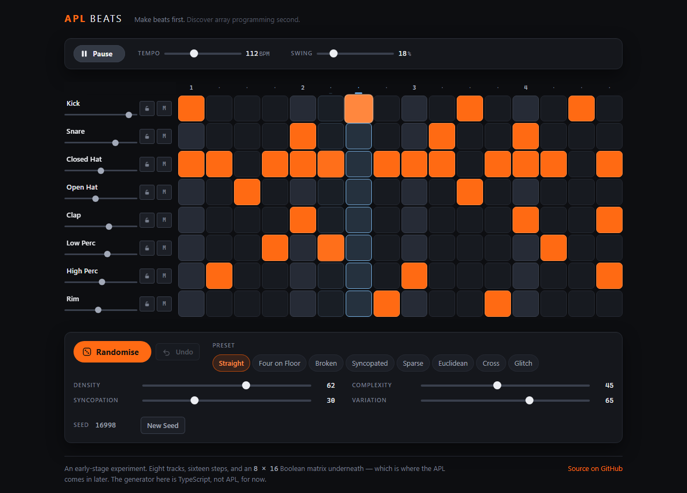
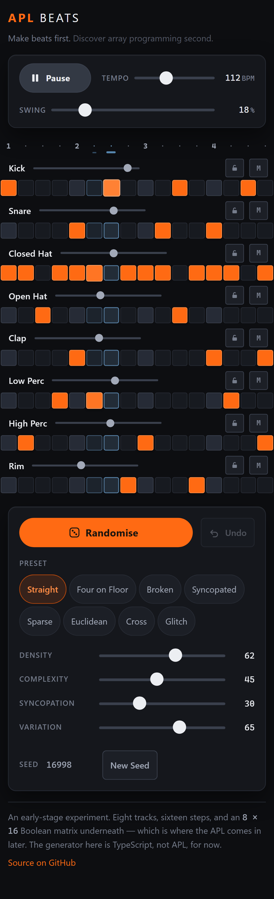

# APL Beats

**Make beats first. Discover array programming second.**

A generative rhythm machine in the browser. Eight tracks, sixteen steps, a groove already
loaded — press Play, then press Randomise.

Live site: <https://dragnim.github.io/aplbeats/>

Underneath the grid is an 8 × 16 matrix of Booleans, which is not an implementation detail
but the whole idea. A rhythm is a rectangular array, array languages are good at
rectangular arrays, and a later release will hand that same matrix to real
[Dyalog APL](https://www.dyalog.com/) and take a transformed one back.

> **APL Beats does not execute any APL yet.** The generator described below is TypeScript.
> The product direction is APL-powered; the current implementation is not, and this
> document will say so until it changes. See [Where APL comes in](#where-apl-comes-in).



---

## Contents

- [What it does](#what-it-does)
- [The generator](#the-generator)
- [The four macros](#the-four-macros)
- [Presets](#presets)
- [Locks](#locks)
- [Undo](#undo)
- [What is not here yet](#what-is-not-here-yet)
- [Local setup](#local-setup)
- [Development commands](#development-commands)
- [How it is put together](#how-it-is-put-together)
- [Audio timing](#audio-timing)
- [Sounds and licensing](#sounds-and-licensing)
- [Review tooling](#review-tooling)
- [Accessibility](#accessibility)
- [Respecting the device](#respecting-the-device)
- [Testing](#testing)
- [Deployment](#deployment)
- [Where APL comes in](#where-apl-comes-in)
- [Licence](#licence)

---

## What it does

- **Eight tracks, sixteen steps.** Kick, Snare, Closed Hat, Open Hat, Clap, Low Perc, High
  Perc and Rim, across one bar of four-four in sixteenth notes.
- **Randomise.** A new take on the groove you have, as far away as Variation allows.
- **New Seed.** A completely new groove, ignoring Variation.
- **Four macros** — Density, Complexity, Syncopation, Variation — each with a distinct
  musical meaning.
- **Eight presets**, which change how the generator behaves rather than loading a fixed
  pattern.
- **A lock per track.** The generator may not touch a locked row; you still can.
- **Undo**, thirty deep, over every creative action.
- **A groove on arrival.** Audio does not autoplay, so the first press of Play is the first
  sound.
- **Play and Pause**, live tempo and swing, mute and a fader per track.
- **Editing by click, tap, drag or keyboard**, unchanged from Stage 1.
- **Your session comes back** when you do — pattern, seed, preset, macros, locks, tempo,
  swing and mixer. It never starts playing on its own.

On a phone the whole bar stays on screen: each track's name, fader, lock and mute move
above its steps rather than beside them.



## The generator

Every groove is a pure function of its inputs:

```
generator version + seed + preset + Density + Complexity + Syncopation
    → a candidate bar
    then Variation decides how much of that candidate is adopted
```

The same inputs give the same 128 Booleans on every machine, for ever. There is no
`Math.random` anywhere in the generation path — the one non-deterministic call in the whole
application is the drawing of a fresh seed when you press Randomise, and everything
downstream of it is reproducible from the number shown on screen.

**Randomise draws a new seed and blends.** Using the current seed would produce the
identical candidate and the button would appear broken from the second press onwards. The
seed shown is therefore the seed of the most recent candidate.

**New Seed regenerates outright.** Variation does not apply. At a low Variation the two
buttons behave very differently, which is what makes both worth having.

**Changing a preset or a macro re-renders the same seed** at the new setting, so the groove
you are shaping stays the groove you are shaping. Variation is the exception: it says what
the _next_ Randomise will do, so moving it does not touch the current bar.

Generation is not a probability per cell. It works from a metrical model — where events
want to be in a bar of four-four — and then from what each instrument wants, and then from
how the eight parts relate to each other. An open hat is placed where the closed hat is
not, and the closed hat gives way where it lands; a clap doubles or shadows the snare; the
high percussion answers the low; the auxiliary tracks play short figures that come round
again rather than scattering single hits. Those relationships are generated, not hoped for.

### The opening bar is hand-written

The pattern APL Beats opens on is the curated groove from Stage 1, not a generated one. A
search over thirty thousand seeds and every preset found nothing better: the closest match
reproduced the curated hat and open-hat rows exactly and its kick almost exactly, but with
a third fewer triggers and thin percussion, and the only bars that reproduced the curated
kick row came from Glitch, differing by nineteen per cent of their cells and measurably
messier.

So the seed, preset and macro values you arrive on are the **starting point for
generating**, not a recipe that produces the bar in front of you. That distinction is
unavoidable in any case — edit three cells by hand and your pattern is no longer what your
seed produces either — and the canonical truth is simply the current matrix plus the
current settings.

## The four macros

All four run 0–100. They are deliberately four different mechanisms, not four names for one
probability.

| Macro           | Question                     | How it works                                                                                                                                                                                                                                                                                                                                                                       |
| --------------- | ---------------------------- | ---------------------------------------------------------------------------------------------------------------------------------------------------------------------------------------------------------------------------------------------------------------------------------------------------------------------------------------------------------------------------------- |
| **Density**     | How much is happening?       | Sets how many events each track gets, within that track's own range. A hat can carry fourteen; a kick rarely wants more than six. Density therefore does not affect every track equally, which is what a kit actually does.                                                                                                                                                        |
| **Complexity**  | How intricate is the rhythm? | Two things, neither of them a count. It opens up the sixteenth grid — at the bottom of the range the odd steps are shut almost completely, so a pattern _cannot_ be intricate however dense it gets. And it lengthens how far the bar goes before repeating itself: a four-step figure four times over is simple, however many notes are in it.                                    |
| **Syncopation** | How far off the beat?        | Blends the metrical weights towards a second profile that favours the offbeat eighths and the sixteenth _before_ each beat — the anticipation, which is what most syncopation actually is. Not an inversion: inverting metrical weight puts events on the weakest positions, which sounds arbitrary rather than syncopated. At high settings it also lets anchored steps displace. |
| **Variation**   | How far does Randomise move? | Chooses how many of the differing cells to take from the candidate, and — more importantly — _which tracks_ take anything at all. At low settings most tracks are left completely alone, so a bar where the hats developed and nothing else did sounds like a decision rather than a fault.                                                                                        |

Measured over forty seeds, Density takes a bar from about eight triggers to about
thirty-five while Complexity holds the count flat within three; Complexity roughly triples
the events on the sixteenth grid and halves how much the bar repeats itself. Those are
properties the tests assert, as directions rather than thresholds.

Macros commit when the gesture ends — the number moves live, the groove moves once. That
discipline matters more than it looks: it is the interaction shape APL will eventually need,
where regenerating on every input event would be a remote call per pixel.

## Presets

A preset is a set of dispositions, not a saved pattern: how many events each instrument
tends towards, where it likes to sit, which positions it insists on, how readily it repeats
itself, and how the eight parts relate. Two seeds under one preset should sound like two
takes by the same drummer; one seed under two presets like two different drummers.

| Preset            | What it is                                                                                                                                                                                                          |
| ----------------- | ------------------------------------------------------------------------------------------------------------------------------------------------------------------------------------------------------------------- |
| **Straight**      | Backbeat, steady hats, few surprises. The kick is pushed off beats two and four so it does not become Four on Floor.                                                                                                |
| **Four on Floor** | A kick on every beat — the one preset whose name is a testable promise — with hats lifting off it.                                                                                                                  |
| **Broken**        | Beats two and four are weighted almost to nothing on the kick, so it lands on the "and" and the pickups. The snare is allowed to arrive early.                                                                      |
| **Syncopated**    | Anticipations everywhere. The widest travel for the Syncopation control.                                                                                                                                            |
| **Sparse**        | Narrower ranges at both ends, reluctant percussion, hats that repeat over a long period — structured space rather than accidental space.                                                                            |
| **Euclidean**     | Bjorklund's even distribution, each track rotated differently so that eight parts do not all begin together. Syncopation moves the rotation, which is the only thing it sensibly can do to an evenly spread rhythm. |
| **Cross**         | Three- and five-step figures against a four-four pulse.                                                                                                                                                             |
| **Glitch**        | Short bursts with deliberate holes, and a snare that will not stay put. The kick stays disciplined, because a kick of random bursts removes the last thing holding the bar together.                                |

**Cross is not called Polyrhythm**, deliberately. The bar is still sixteen steps and still
repeats, so these are cross-rhythms _within_ a bar rather than independent cycles of
different lengths. Calling it Polyrhythm would claim an architecture this stage does not
have, and expanding the transport to get one was explicitly out of scope.

## Locks

A lock means **the generator may not alter this row**. It does not mean you may not: a
locked track stays fully editable by hand, which is the point — you keep a kick you like and
explore a completely different preset around it.

Locks are respected by Randomise, New Seed, preset changes and macro regeneration alike.
There is no code path in which a locked row is generated and then restored, so there is
nothing to get wrong. Lock state is itself part of Undo.

## Undo

Thirty steps, over the creative state: pattern, seed, preset, all four macros, and locks.

Tempo, swing and the mixer are deliberately **outside** it. They are how you listen to what
you made rather than part of it, and putting them in the history would mean that an Undo
after nudging a fader threw away the groove you had been building.

One action is one entry. A drag across eight cells is one Undo; a slider dragged through
fifty values is one Undo, banked when the gesture began and committed when it ended. There
is no Redo in this stage.

## What is not here yet

Named because a README that lists ambitions alongside features cannot be trusted about
either. None of the following exists:

- **APL.** No editor, no execution, no TryAPL, no network request of any kind.
- Sharing, WAV export, MIDI, accounts.
- More than one bar; variable track lengths; song arrangement.
- Per-step velocity or probability. A step fires or it does not.
- Effects, sample uploads, a light theme.

## Local setup

Requires **Node 22**, not merely Node 22 or later. `.nvmrc` says so and `engines` refuses
anything newer, so that a build here and a build in CI produce the same bundle.

```bash
git clone https://github.com/dragnim/aplbeats.git
cd aplbeats
nvm use        # reads .nvmrc; CI reads the same file
npm install
npm run dev
```

## Development commands

| Command                     | What it does                                                                     |
| --------------------------- | -------------------------------------------------------------------------------- |
| `npm run dev`               | Vite dev server                                                                  |
| `npm run build`             | Typecheck, then build to `dist/`                                                 |
| `npm run preview`           | Serve `dist/` at the published base path                                         |
| `npm run typecheck`         | `tsc --noEmit`                                                                   |
| `npm run lint`              | ESLint, type-aware                                                               |
| `npm run format:check`      | Prettier, checking — this is what CI runs                                        |
| `npm test`                  | Unit and component tests, once                                                   |
| `npm run test:e2e`          | Playwright, across three browser projects                                        |
| `npm run review:patterns`   | Inspect many generated bars — see [Review tooling](#review-tooling)              |
| `npm run screenshot`        | Capture the interface to `docs/`, against a running preview                      |
| `npm run measure:kit`       | Render every voice offline and report its level and length (needs `npm run dev`) |
| `npm run measure:generated` | Render generated bars through the real master chain and check for clipping       |
| `npm run verify:deployment` | Load the published site and check it works                                       |

## How it is put together

Vite, React and TypeScript in strict mode, with CSS Modules over a token layer. No state
library, no component library, no audio library. The dependency list is React and nothing
else.

```
src/
  generation/  the generator — pure, deterministic, and knows nothing of React
    prng.ts        a 32-bit PRNG; streams derived per track by hashing
    weights.ts     the metrical model and what the macros do to it
    euclidean.ts   Bjorklund's algorithm, alone in a file
    presets.ts     eight sets of dispositions, almost entirely data
    generator.ts   settings → an 8 × 16 matrix
    mutate.ts      how much of a candidate to adopt
    metrics.ts     measurement, for the tests and the review tooling
  pattern/     the matrix, the eight tracks, the mixer, the opening groove
  transport/   the timing arithmetic, the look-ahead scheduler, the transport
  audio/       the AudioContext boundary, the synthesised kit, the DSP pieces
  components/  the sequencer grid, the generator panel, the transport bar
  app/         the creative state and its history, persistence, the shell
  styles/      tokens and the global sheet
```

Four rules shape it.

**The pattern is a matrix and nothing else** — `readonly boolean[][]`, with pure functions
over it. `toBits` and `fromBits` are the numeric form APL will exchange.

**Generation is pure and outside React.** Nothing in `generation/` imports React, touches a
clock, or draws randomness it was not given. The reducer that drives it is pure too:
Randomise is _handed_ its seed rather than drawing one, which is why every behaviour in this
stage can be tested by stating inputs and reading outputs.

**Per-track random streams, derived by hashing.** Without that, one extra hat would shift
every later draw and rewrite the whole kit — which would make locks impossible and Variation
meaningless.

**The audio clock and the render loop never touch.** See below.

## Audio timing

Unchanged from Stage 1, and deliberately so.

```
a timer wakes about 40 times a second
  → looks 100 ms into the future
  → hands every step in that window to Web Audio, with an exact time
  → Web Audio plays it on the audio thread, to the sample
```

The playhead is a _consequence_ of what was scheduled: it reads the audio clock and reports
the last step it has passed, so a frame drawn late shows where the music is rather than
where it was when the frame was requested.

**A generated pattern takes effect immediately, not on the next bar line.** The matrix is
immutable, so the swap is atomic — a step already handed to Web Audio played from a complete
bar, and the next one plays from a complete bar. There is no window in which half a pattern
can be heard. Bar-quantising was considered and rejected: it would mean the grid showing one
pattern while another played for up to two seconds, and it would put a deadline inside the
scheduler that Stage 1 deliberately keeps clear. With a hundred-millisecond look-ahead a
swap is audible within about a sixteenth anyway.

## Sounds and licensing

**Everything is synthesised in the browser.** There is no audio file in this repository,
none is fetched, and nothing streams from anywhere during playback. See
[THIRD_PARTY_NOTICES.md](THIRD_PARTY_NOTICES.md). Sound design remains provisional; `Kit` in
`src/audio/kit.ts` is the seam a sampled kit would arrive through.

The generator can now produce bars with forty-odd triggers and seven voices landing on one
sixteenth, which the hand-written opening groove never did. `npm run measure:generated`
renders those bars through the real master chain and reports what comes out: at Density 100
across every preset, peaks sit between −0.4 and −0.9 dBFS with no clipped samples.

## Review tooling

Judging a generator one Randomise press at a time is hopeless — you cannot tell whether a
preset has collapsed, whether one track dominates every result, or whether two seeds are
quietly producing the same bar. `npm run review:patterns` prints them together.

```
npm run review:patterns                     every preset, 12 seeds each
npm run review:patterns -- --seeds 24       more of them
npm run review:patterns -- --preset broken  one preset, in full
npm run review:patterns -- --sweep density  one preset across a macro's range
npm run review:patterns -- --summary        statistics only, no grids
npm run review:patterns -- --plateau        how wide Density's dead zones are
```

It prints readable grids and, per preset, the trigger range, how much the bars repeat
themselves, the share of events off the beat, the largest simultaneous stack, and how close
the two most similar seeds are. It flags duplicates, tracks that never fire, and tracks
whose event count never changes.

There is deliberately **no quality score**. Every number is a count or a ratio, and what
they are for is making bars comparable so that a person can look at forty of them and see
what is wrong. A generator tuned to optimise a number would produce bars that scored well,
which is not the same thing as bars worth listening to.

It earned its place within minutes of existing, and has since found: every seed under a
preset producing exactly the same number of events on every track (Euclidean was pinned at
twenty-two triggers for every seed alive); `periodBias` implemented with the opposite sign to
its own documentation; required steps inflating every count and destroying the repetition
that low Complexity exists to produce; Density dead zones ten points wide; a snare on all
four beats sitting underneath a kick on all four beats; auxiliary tracks scattering isolated
single hits; snares doubling on adjacent sixteenths; and low percussion playing the snare's
figure note for note.

## Accessibility

Everything from Stage 1 still holds — every step is a real button with an accessible name and
`aria-pressed`, one Tab stop for the whole grid, arrow keys and Home and End and Space,
colour never the only signal, WCAG 2.2 AA contrast, and reduced motion honoured.

The Stage 2 controls follow the same rules:

- **Randomise, New Seed and Undo are real buttons.** Undo is genuinely `disabled` when there
  is nothing to undo, so a keyboard visitor is told rather than being sent to a button that
  does nothing.
- **Presets are a radio group** in a labelled fieldset, so arrow keys work and the current
  choice is programmatically the checked one. The chosen preset is outlined rather than
  filled, so there is still exactly one solid accent on the page to press.
- **Locks are toggle buttons** carrying `aria-pressed`, labelled "Lock Kick against the
  generator" — because the promise a lock makes is about the generator, not about you.
- **Every slider has a programmatic label and value**, and the numeric readouts beside them
  are `aria-hidden` because the slider already reports its value.

Not yet audited with an actual screen reader, which remains the honest gap.

## Respecting the device

- **Stopped means stopped.** No scheduler timer, no animation frame, and the `AudioContext`
  suspended.
- **Leaving the tab pauses the transport.**
- **Generation happens once per deliberate action**, never while a control is moving. The
  session write is debounced.
- **Nothing is fetched at runtime.** The Content-Security-Policy says `connect-src 'self'`,
  which is a true statement about the application rather than a restriction being worked
  around.

## Testing

```bash
npm test          # 207 unit and component tests, in jsdom
npm run test:e2e  # 66 end-to-end runs across three browser projects
```

The generator is tested as **properties, not snapshots**. It is expected to be tuned again —
that is what the review tooling is for — and a test pinning twenty-four bars cell by cell
would fail on every improvement and tell nobody anything. So what is asserted is what must
stay true whatever the weights become: the shape, the determinism, the locks, and the
direction each control moves things in. The statistical tests sample forty seeds and assert a
direction; a single seed is allowed to disobey, the population is not.

Four real bugs were found by these tests rather than by inspection: Syncopation at 100 putting
a _smaller_ share of events off the beat than at 0; committing any macro regenerating the bar,
so that touching Variation silently replaced the curated opening; a drag whose first crossed
cell already held the painted value banking no history and swallowing the rest of the drag;
and Variation's track-spread saturating by the middle of its range.

Three browser projects, because Playwright's WebKit is built without Web Audio —
`AudioContext` is not on the window at all. So the phone layout is checked on the engine
phones run, touch is checked on an engine that can make a sound, and the audio tests ask the
page whether Web Audio exists and skip themselves rather than pretending.

What no test covers is whether it grooves. That is judged by ear.

## Deployment

One workflow. `verify` and `e2e` must both pass before the Pages artifact is built, and the
deploy step abandons itself if `main` has moved on. The published base path comes from
`actions/configure-pages`, so renaming the repository needs no code change.

## Where APL comes in

Not yet — but the shape is already decided, and it is the reason for several of the choices
above.

```
APL generates or transforms a complete pattern matrix
  → the browser receives the matrix
  → Web Audio plays it locally
```

APL will run **once per deliberate action** and never once per beat, once per step, once per
animation frame, or continuously while a control is dragged. Requests will be sparse, cached
and preferably batched. Two things in this stage are already built for that: the generator is
a pure function from settings to a matrix, so replacing its innards changes nothing above it;
and the macros commit on gesture end rather than on input, which is the same discipline a
remote call will require.

`euclidean.ts` is kept small and alone for the same reason — Bjorklund's recursion beside the
one line of APL that does the same thing is a large part of the point of the project.

## Licence

[MIT](LICENSE). An independent personal project, not a Dyalog product.
